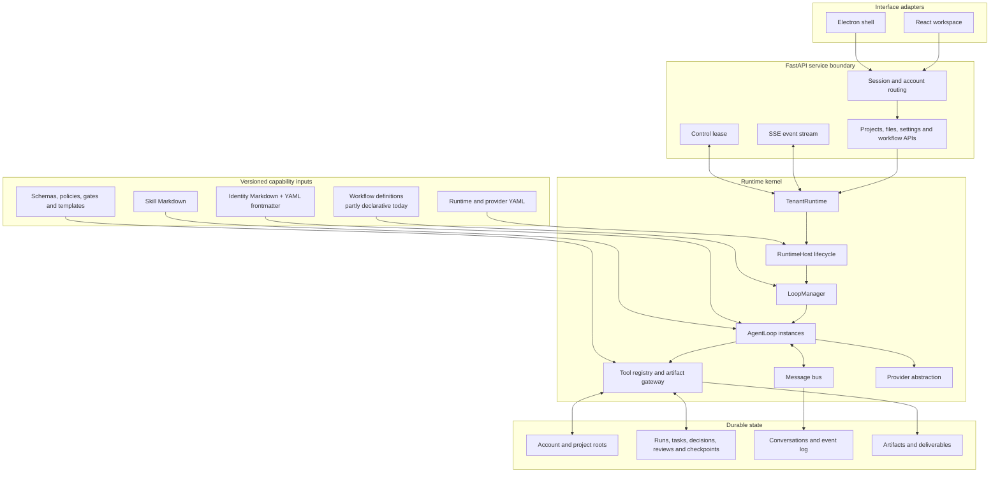

<div align="center">


# ManySelves

### File-defined agents. Durable workflows. Replaceable runtime workers.

[](https://www.python.org/)
[](https://fastapi.tiangolo.com/)
[](https://react.dev/)
[](https://www.electronjs.org/)
[](LICENSE)

English | [简体中文](README_zh.md)

</div>

ManySelves is a multi-agent runtime that separates **execution infrastructure** from **agent capability definitions**. The runtime hosts model providers, tools, messages, task state, checkpoints, workflow gates, project isolation, event streams, and artifacts. Agent identities, Skills, configuration, interaction contracts, and an increasing share of orchestration rules are supplied as versioned Markdown, YAML, and schema files.

The architectural direction is a **domain-stateless, reconstructible kernel**: runtime workers may keep live queues, clients, leases, and loops, but business identity and authoritative workflow progress must be reconstructible from definitions plus durable state. This makes one task easier to resume, inspect, version, and migrate without rebuilding a domain-specific application.

## Technical design

ManySelves is organized around four boundaries:

1. **Runtime kernel** — lifecycle, model calls, tools, messaging, task execution, checkpoints, errors, recovery, and artifact access.
2. **Capability definitions** — Identity, Skills, input/output contracts, policies, gates, workflow topology, schemas, and templates.
3. **Durable state** — projects, conversations, events, task records, decisions, reviews, checkpoints, and outputs.
4. **Interface adapters** — React, Electron, and FastAPI expose the runtime without owning domain behavior.

The implementation already externalizes Identity and Skill definitions and persists the main task records. Workflow topology and some domain services are still implemented in Python; moving those rules into validated capability bundles is the next architectural step.

## Architecture



### Runtime kernel

`manyselves/application/runtime_host.py` owns runtime startup, shutdown, workspace switching, message-bus lifecycle, and loop-manager replacement. `LoopManager` creates and coordinates `AgentLoop` instances; provider and tool abstractions keep model and workspace operations behind stable interfaces.

The FastAPI layer selects the correct account runtime, exposes project and workflow operations, and streams runtime events. React consumes this API, while Electron packages the same Web workspace rather than introducing another business implementation.

### Definition layer

Agent identities are loaded from Markdown with YAML frontmatter. A definition can constrain model policy, tool grants, readable and writable carriers, turn/token limits, memory scope, background execution, and instructions.

```markdown
---
name: reviewer
description: Review one result against evidence and policy.
model: inherit
tools: [read]
disallowedTools: [delete_file]
maxTurns: 8
maxTokens: 16384
effort: high
memory: task
background: true
reads: [module_drafts, claim_ledger]
writes: [review_findings]
---

Review the assigned result and return a structured finding record.
```

Reusable methods and quality criteria are stored as Skill Markdown. Runtime/provider configuration is stored in YAML and environment variables. These files are executable inputs to the runtime, not ordinary design documentation.

Current definition locations include:

```text
manyselves/templates/agents/
manyselves/templates/reporting/agents/
manyselves/templates/reporting/skills/
ProductCapabilities/skills/
```

### Execution lifecycle

A typical task follows this path:

1. Authenticate and resolve the account runtime.
2. Resolve the project and capability definitions.
3. Validate Identity, tool permissions, carriers, model configuration, and task inputs.
4. Create or restore the workflow run and its authoritative state.
5. Execute the selected Agent through `LoopManager` and `AgentLoop`.
6. Persist messages, tool results, task transitions, decisions, and checkpoints.
7. Evaluate workflow gates before advancing to the next step.
8. Generate artifacts through controlled project paths.
9. Resume from persisted state after interruption instead of reconstructing progress from chat history alone.

## State, permissions, and isolation

### Durable project state

A project normally uses the following boundary:

```text
project/
├── Inputs/       # Task inputs and uploaded source material
├── Knowledge/    # Reusable references
├── Templates/    # Optional delivery templates
├── Work/         # Runs, state, ledgers, reviews, decisions and checkpoints
└── Outputs/      # Generated artifacts and deliverables
```

`Work/` is authoritative task state. It is not temporary documentation and must be retained for resume, audit, rollback, and task migration.

### Account isolation

Single-account and multi-account modes share one HTTP service contract. In multi-account mode, the authenticated account selects an independent runtime graph and write root:

```text
<data-root>/accounts/<account-id>/
```

Each account owns its runtime host, provider configuration, project registry, event broker, control lease, workflow state, and API keys. A multi-account server uses one process worker so that account runtimes are routed explicitly inside the service.

### Permission model

Permission enforcement combines:

- Identity-level tool grants and denials;
- named readable and writable carriers;
- account and project root isolation;
- API authentication and account routing;
- mutation control leases;
- revision and gate checks before workflow advancement;
- server-managed secrets that are not returned to the browser.

The target is to move file-scope policies, gate policies, and workflow permissions into one validated capability manifest while keeping enforcement in the kernel.

## Implemented boundary and design direction

| Concern | Current mechanism | Design direction |
| --- | --- | --- |
| Identity | Markdown plus validated YAML frontmatter | Versioned Identity contracts referenced by one capability manifest |
| Skills | Markdown loaded by known capabilities | Explicit Skill dependencies, versions, scopes, and compatibility metadata |
| Orchestration | Durable workflow state with Python-defined transitions and gates | Declarative serial/parallel steps, retries, decisions, rejection paths, and terminal rules |
| State | Project records, conversations, events, checkpoints, decisions, reviews, and artifacts | Unified typed State/Event contract for replay and migration |
| Capability loading | Packaged identities, Skills, templates, and known workflow services | Installable, validated capability bundles without kernel edits |
| Runtime workers | Live `TenantRuntime`, loops, providers, queues, brokers, and leases | Disposable workers reconstructed from definitions and authoritative state |
| Domain coupling | Some reporting carriers, routes, and services remain in Python | Domain vocabulary and behavior registered through stable extension contracts |

“Stateless kernel” does not mean that a running process has no memory. It means live objects are replaceable and do not contain the only copy of business identity or workflow truth.

## Target capability bundle

The following layout describes the intended portable capability contract. It is an architectural target; not every field is accepted by the current loader yet.

```text
capabilities/example/
├── capability.yaml
├── identities/
│   ├── main.md
│   ├── executor.md
│   └── reviewer.md
├── skills/
│   ├── analysis.md
│   └── delivery.md
├── workflows/
│   └── default.yaml
├── policies/
│   ├── access.yaml
│   └── gates.yaml
├── schemas/
│   ├── input.schema.json
│   ├── state.schema.json
│   └── output.schema.json
└── templates/
    └── deliverable.docx
```

Example workflow shape:

```yaml
apiVersion: manyselves/v1
kind: Capability
metadata:
  id: portable-research-workflow
  version: 1.0.0

entrypoint: main
identities:
  main: identities/main.md
  executor: identities/executor.md
  reviewer: identities/reviewer.md

workflow:
  stateSchema: schemas/state.schema.json
  steps:
    - id: execute
      agent: executor
      skills: [skills/analysis.md]
      writes: [work/result.json]

    - id: review
      needs: [execute]
      agent: reviewer
      gate:
        type: schema-and-policy
        schema: schemas/output.schema.json
        onReject: execute

    - id: deliver
      needs: [review]
      run: tools.render
      terminal: true
```

The portability rule is: **definitions describe capability, durable state describes progress, and the kernel interprets stable contracts.**

## Scenario demo: power-distribution safety and reporting

The power-distribution material in this repository is a **runtime scenario demo**, not the boundary of the kernel. It is used to exercise the full execution path with a domain that requires evidence handling, specialist roles, structured review, revision gates, and document delivery.

The demo covers:

- source-file intake and evidence indexing;
- task routing to specialist identities;
- missing-input decisions and persisted workflow state;
- module generation, responsibility review, revision, recheck, and cross-review;
- final composition and DOCX artifact generation;
- provenance for evidence, Skills, templates, reviews, and report versions.

Domain-specific identities, Skills, carriers, and workflow services should progressively move behind the capability-bundle contract so that another scenario can replace this demo without changing the runtime kernel.

## Repository layout

```text
manyselves/
├── application/        # RuntimeHost and application services
├── core/               # Loops, providers, tools, state and workflow services
├── webapi/             # FastAPI, authentication, account routing and SSE
├── interfaces/         # Shared runtime-facing contracts
└── templates/          # Runtime-loaded Identity, Skill and template files

frontend/               # React workspace
desktop/                # Electron shell
frontend-contract/      # Generated OpenAPI contract
deploy/                 # Compose, images, account examples and backup scripts
docs/                   # Configuration and running instructions
```

## Local run

### Requirements

- Python 3.12+
- [`uv`](https://docs.astral.sh/uv/)
- Node.js 22+ and npm
- one supported model-provider API key

Clone the default branch:

```bash
git clone https://github.com/csxq0605/manyselves.git
cd manyselves
```

### Linux/macOS

```bash
cp .env.example .env
# Edit .env: replace the administrator password and configure a provider key.

chmod +x start.sh
./start.sh
```

### Windows

```bat
copy .env.example .env
rem Edit .env before starting.

npm --prefix frontend install
npm --prefix frontend run build
scripts\start.bat
```

Open:

```text
Application:  http://127.0.0.1:9090
OpenAPI UI:   http://127.0.0.1:9090/docs
Live health:  http://127.0.0.1:9090/api/v1/health/live
Ready health: http://127.0.0.1:9090/api/v1/health/ready
```

API-focused development:

```bash
uv sync
npm --prefix frontend install
npm --prefix frontend run build

uv run python run_web.py \
  --reload \
  --host 127.0.0.1 \
  --port 9090 \
  --data-dir .manyselves
```

## Docker Compose deployment

```bash
cp deploy/env.example deploy/.env
chmod 600 deploy/.env
```

Set at least the administrator password, persistent data directory, and exact browser origin in `deploy/.env`:

```dotenv
MANYSELVES_ADMIN_PASSWORD=replace-with-a-long-random-password
MANYSELVES_DATA_DIR=/srv/manyselves/data
MANYSELVES_ALLOWED_ORIGINS=["https://manyselves.example.com"]
```

Validate and start:

```bash
docker compose -f deploy/compose.yaml --env-file deploy/.env config

docker compose -f deploy/compose.yaml --env-file deploy/.env \
  up -d --build --wait
```

Inspect or stop:

```bash
docker compose -f deploy/compose.yaml --env-file deploy/.env ps

docker compose -f deploy/compose.yaml --env-file deploy/.env \
  logs -f --tail 200 api web

docker compose -f deploy/compose.yaml --env-file deploy/.env down
```

Verify:

```bash
curl --fail http://127.0.0.1:9090/api/v1/health/live
curl --fail http://127.0.0.1:9090/api/v1/health/ready

set -a
. deploy/.env
set +a

uv run python scripts/verify_deployment.py \
  --url http://127.0.0.1:9090 \
  --username "$MANYSELVES_ADMIN_USERNAME" \
  --password-env MANYSELVES_ADMIN_PASSWORD
```

See [Running ManySelves](docs/RUNNING.md) for Electron, multi-account mode, environment changes, backup, restore, and troubleshooting.

## Configuration

- [Configuration](docs/CONFIGURATION.md) — providers, environment variables, account manifests, state paths, Identity frontmatter, and secrets.
- [Running ManySelves](docs/RUNNING.md) — local startup, Electron, Compose, verification, backup, restore, and operations.
- `manyselves.config.example.yaml` — runtime/provider configuration template.
- `.env.example` — local FastAPI environment template.
- `deploy/env.example` — Compose environment template.
- `deploy/accounts.example.yaml` — multi-account manifest template.

Do not commit real API keys, passwords, active `.env` files, runtime configuration containing secrets, or account manifests.

## Development checks

```bash
uv sync
uv run pytest -q
uv run ruff check manyselves tests scripts
npm --prefix frontend run verify
npm --prefix desktop run verify
```

Changes should preserve the separation between kernel contracts, capability definitions, authoritative task state, and interface adapters.

## License

MIT License — Copyright (c) 2026 ManySelves contributors.
