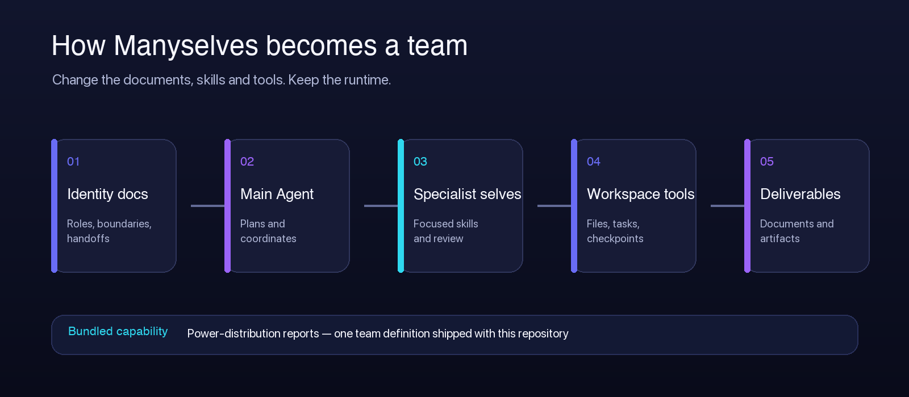
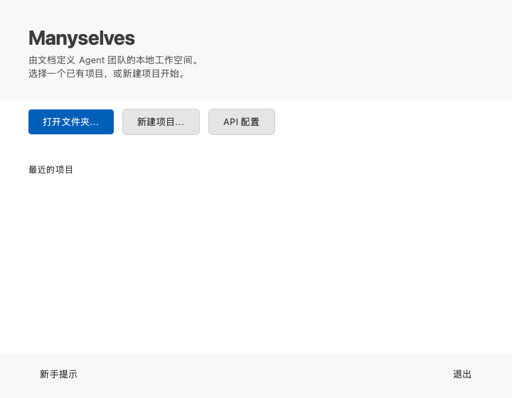
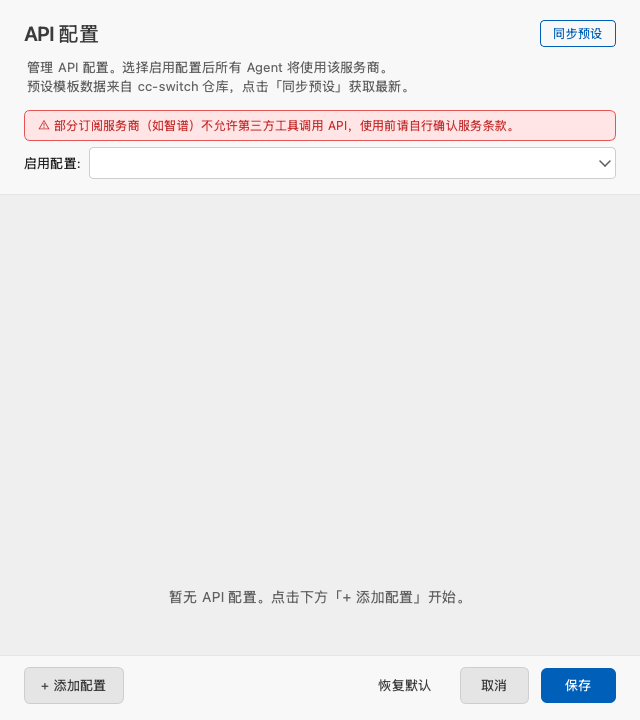

<div align="center">


### One runtime. Many selves.

**A local workspace for document-defined agent teams.**

[](#)
[](https://www.python.org/)
[](https://www.riverbankcomputing.com/software/pyqt/)
[](LICENSE)

English | [中文](README_zh.md)

</div>

## What is Manyselves?

Manyselves is a local desktop runtime for teams of AI agents whose identities,
boundaries, skills, and handoffs live in documents. Keep the same workspace and
change those definitions to turn it into a different team.

The runtime supplies the durable parts: a Main Agent conversation, project file
tree, document preview, task routing, tools, checkpoints, provider integration,
and local artifacts. The repository currently ships a production-grade
power-distribution reporting team as its bundled capability; that team is an
example of what the runtime can host, not the limit of the product.



## Define the team, not another app

Three layers shape a Manyselves team:

1. **Identity documents** define each Agent's role, constraints, inputs, outputs,
   and handoffs.
2. **Skill documents** encode reusable domain methods and quality criteria.
3. **Runtime tools and workflows** connect those definitions to files, state,
   review, and deliverables.

The current definitions are under `manyselves/templates/agents/` and
`manyselves/templates/reporting/`. See [Defining a team](docs/team-definition.md)
for the separation between document-only customization and Python extensions.

## Runtime capabilities

- **One stable Main surface** — users talk to Main while task-scoped specialists,
  auditors, reviewers, and editors report through one timeline.
- **Local project workspace** — inspect inputs, knowledge, work state, and outputs
  without moving project data to a separate product database.
- **Document context** — preview files, add `@` references, attach selected lines,
  and render Markdown in conversation.
- **Reliable execution** — streaming responses, task routing, typed state,
  checkpoints, rollback, and resumable decisions.
- **Multiple LLM providers** — Anthropic, OpenAI, DeepSeek, and compatible APIs,
  with provider presets and runtime model selection.
- **Extensible delivery** — tools and workflows can produce documents, review
  records, ledgers, state snapshots, and other project artifacts.

## Quick start

Requirements: Python 3.12+, [uv](https://docs.astral.sh/uv/), and an API key for
at least one supported LLM provider.

```bash
git clone <repository-url> manyselves
cd manyselves
uv sync
uv run manyselves
```



Without `uv`, create the virtual environment inside the repository:

```bash
python3.12 -m venv .venv
.venv/bin/python -m pip install -e .
.venv/bin/manyselves
```

You can preconfigure provider keys through environment variables:

```bash
export ANTHROPIC_API_KEY="sk-ant-..."
export OPENAI_API_KEY="sk-..."
export DEEPSEEK_API_KEY="sk-..."
uv run manyselves
```

## Browser, Electron, and server deployment

Phase 1 supports the existing PyQt desktop, a React browser client, and a secure
Electron client against one FastAPI Runtime.

### Local Python deployment (no Docker)

For local development or simple deployment without Docker:

```bash
# Quick start
python run_web.py

# Or use the startup script
./start.sh  # Linux/macOS
start.bat    # Windows
```

See [Local Run Guide](docs/RUN_LOCAL.md) for detailed instructions.

### Docker deployment

For Linux server installation, daily operation, backup/restore, and upgrade/rollback, follow
[the Compose deployment guide](docs/deployment/linux-compose.md). The concise
release limitations are in [Phase 1 known limitations](docs/phase1/known-limitations.md).
For a server-side preflight that does not replace the LAN stack, use
`deploy/smoke.env.example` with the isolated `manyselves-phase1-smoke` project
documented in the Compose guide.

```bash
cp deploy/env.example deploy/.env
# Set the provider key and absolute data directory. The reviewed LAN login
# defaults are admin / yuanxi@2026 and can be changed only on the server.
docker compose -f deploy/compose.yaml --env-file deploy/.env up -d --build --wait
set -a
. deploy/.env
set +a
uv run python scripts/verify_deployment.py \
  --url http://192.168.8.28:9090 \
  --username "$MANYSELVES_ADMIN_USERNAME" \
  --password-env MANYSELVES_ADMIN_PASSWORD
```

## Configuration and local state

The canonical application configuration is the repository-root
`manyselves.config.yaml`, regardless of the directory from which Manyselves is
launched. The canonical Python namespace is `manyselves`.

Explicit configuration paths still override the default. Application preferences
stay under the repository-root `.manyselves/` directory; project state and
deliverables stay inside the selected project.



```yaml
agents:
  defaults:
    model: "anthropic/claude-sonnet-4.5"
    temperature: 0.1
    max_tool_iterations: 200
```

## Bundled capability: power-distribution reports

The included team coordinates evidence intake, five sequentially gated report modules,
responsibility audit, cross-module review, Chief Editor integration, governed
Skill evolution, and template-backed DOCX delivery.

Customer facts go in `Inputs/`; project standards and interpretation references
go in `Knowledge/`. The workflow recognizes the three core workbooks, WPS
`DISPIMG` media, XLSX/XLSM, DOCX, Markdown, text, images, and PDF. Unsupported
DWG and video files remain visible as `manual_required` instead of disappearing.

Customer facts (`E-*`), reference sources (`R-*`), claims, coverage, missing
evidence decisions, loaded Skill versions, review findings, and report versions
remain auditable. Knowledge and web sources can support interpretation but never
become customer-site facts.

The five fixed modules 2.1–2.5 run in a fixed order. Each module completes
drafting, responsibility audit, targeted revision, and recheck before the next
module starts; all five then pass cross review and complete-document composition.
Missing evidence can `ask`, `block`, `skip`, or `draft`; durable decisions survive
process restarts. A post-delivery revision restores a baseline, reruns only the
responsible module, rechecks the full report, and publishes an immutable child
version.

Typical project output:

```text
project/
├── Inputs/                         # Customer facts
├── Knowledge/                      # Project references
├── Templates/                      # Optional report_template.docx override
├── Work/
│   ├── evidence.jsonl
│   ├── coverage.json
│   ├── report-state.json
│   ├── runs/<run-id>/              # State, modules, reviews, ledgers, decisions
│   └── report-versions/<id>/        # Immutable version snapshots
└── Outputs/
    ├── Modules/                     # Modules 2.1–2.5
    ├── Reviews/                     # Responsibility and cross-module reviews
    └── Reports/                     # Complete DOCX and render log
```

Skill evolution is separate from report revision and requires explicit intent:
`FeedbackRecord → SkillCandidate → EvaluationResult → confirmation → SkillVersion`.
Later runs resolve packaged, product, then project Skills; every report version
freezes the exact IDs, versions, scopes, hashes, and template provenance it used.

See the [full capability contract](docs/capabilities/power-distribution.md) for
evidence decisions, acceptance boundaries, revision, and artifact details.

## Optional document parsing

Manyselves can use an optional document-conversion CLI to convert PDF, images,
DOCX, PPTX, and XLSX to Markdown. Install and authenticate a compatible converter;
the application detects it at startup. Core local workspace use does not depend
on this integration.

## Architecture

```text
manyselves/                         # Canonical Python package
├── app.py                          # CLI and desktop startup
├── branding.py                     # Public product identity contract
├── config/                         # Repository-local YAML configuration
├── core/
│   ├── loops/                      # Agent runtime and MessageBus
│   ├── providers/                  # LLM provider abstraction
│   ├── reporting/                  # Bundled reporting capability
│   └── tools/                      # Workspace and workflow tools
├── gui/                            # PyQt6 desktop interface
├── resources/                      # Manyselves application icon
└── templates/
    ├── agents/                     # Main identity and common policy
    └── reporting/                  # Bundled team identities and Skills
```

## Development

```bash
QT_QPA_PLATFORM=offscreen uv run pytest -q
uv run ruff check manyselves tests scripts
uv run python scripts/build_brand_assets.py
```

See [Brand system](docs/brand.md) for naming, assets, palette, and compatibility
rules.

## Product identity

Manyselves is maintained as an independent product with its own name, package,
assets, documentation, configuration, and release artifacts.

## License

MIT License — Copyright (c) 2026 Manyselves contributors.
