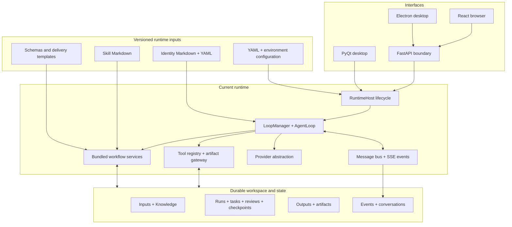

<div align="center">


# ManySelves

### One runtime. Many selves.

**A production multi-agent runtime for file-defined teams and durable workflows.**

[](https://www.python.org/)
[](https://fastapi.tiangolo.com/)
[](#current-release-capabilities)
[](#release-status)
[](LICENSE)

English | [简体中文](README_zh.md)

</div>

ManySelves is a deployed multi-agent runtime that turns versioned **Identity documents** and **Skill documents** into executable teams. The runtime supplies the operational layer around those definitions: model access, tool execution, messaging, project workspaces, task state, checkpoints, review gates, recovery, and deliverable generation.

The current release is online and can be used through PyQt, React + FastAPI, or Electron. It includes a complete power-distribution reporting capability as the strongest reference implementation, while the runtime itself is designed to support more teams and task types.

> **Architecture roadmap, not current release status**
>
> A domain-stateless, reconstructible kernel is the final architecture goal. The live release already separates many identities and Skills into files and persists important task state, but some workflow graphs, transition rules, and domain services are still implemented in Python. That future direction is documented separately below and does not change the Production/Stable status of the current deployed feature set.

## Run or deploy

### 1. Clone the maintained branch

```bash
git clone --branch feature/react-fastapi-manyselves \
  https://github.com/csxq0605/manyselves.git
cd manyselves
```

### 2. Local Web: React + FastAPI

Linux/macOS:

```bash
cp .env.example .env
# Edit .env: replace the administrator password and configure a provider key.

chmod +x start.sh
./start.sh
```

Windows Command Prompt or PowerShell:

```bat
copy .env.example .env
rem Edit .env. On Windows, write MANYSELVES_ALLOWED_ORIGINS as:
rem MANYSELVES_ALLOWED_ORIGINS=["http://127.0.0.1:9090"]

npm --prefix frontend install
npm --prefix frontend run build
scripts\start.bat
```

Open:

```text
Application:  http://127.0.0.1:9090
OpenAPI UI:   http://127.0.0.1:9090/docs
Live health:  http://127.0.0.1:9090/api/v1/health/live
Ready health: http://127.0.0.1:9090/api/v1/health/ready
```

For API-focused development:

```bash
uv sync
npm --prefix frontend install
npm --prefix frontend run build

uv run python run_web.py \
  --reload \
  --host 127.0.0.1 \
  --port 9090 \
  --data-dir .manyselves
```

### 3. Local desktop: PyQt

```bash
uv sync
cp manyselves.config.example.yaml manyselves.config.yaml
uv run manyselves
```

A provider can be configured in the application or through supported environment variables. The workspace can open without a provider key, but model calls require an enabled provider.

### 4. Server deployment: Docker Compose

```bash
cp deploy/env.example deploy/.env
chmod 600 deploy/.env
```

Before starting, edit `deploy/.env` and set at least:

```dotenv
MANYSELVES_ADMIN_PASSWORD=replace-with-a-long-random-password
MANYSELVES_DATA_DIR=/absolute/path/to/persistent-data
MANYSELVES_ALLOWED_ORIGINS=["https://your-manyselves-domain.example"]
```

For a server exposed directly rather than through a loopback reverse proxy, also set an appropriate bind address:

```dotenv
MANYSELVES_HTTP_BIND=0.0.0.0
MANYSELVES_HTTP_PORT=9090
```

Start:

```bash
docker compose -f deploy/compose.yaml --env-file deploy/.env config
docker compose -f deploy/compose.yaml --env-file deploy/.env \
  up -d --build --wait
```

Inspect or stop:

```bash
docker compose -f deploy/compose.yaml --env-file deploy/.env ps
docker compose -f deploy/compose.yaml --env-file deploy/.env \
  logs -f --tail 200 api web
docker compose -f deploy/compose.yaml --env-file deploy/.env down
```

Verify the HTTP boundary:

```bash
curl --fail http://127.0.0.1:9090/api/v1/health/live
curl --fail http://127.0.0.1:9090/api/v1/health/ready
```

For the authenticated public-API verification drill:

```bash
uv sync
set -a
. deploy/.env
set +a

uv run python scripts/verify_deployment.py \
  --url http://127.0.0.1:9090 \
  --username "$MANYSELVES_ADMIN_USERNAME" \
  --password-env MANYSELVES_ADMIN_PASSWORD
```

See [Running ManySelves](docs/RUNNING.md) for Electron, multi-account mode, backup, restore, deployment verification, and troubleshooting.

## Current release capabilities

### One runtime behind multiple interfaces

- **FastAPI** exposes the runtime boundary, authentication, projects, files, settings, control operations, reporting APIs, and server-sent events.
- **React** provides the browser workspace.
- **Electron** packages the browser client as a desktop surface.
- **PyQt6** remains available as the original local desktop interface.
- All interfaces are intended to invoke the same runtime concepts rather than reimplement business behavior.

### File-defined identities and Skills

Packaged identities live under:

```text
manyselves/templates/agents/
manyselves/templates/reporting/agents/
```

They are Markdown files with YAML frontmatter describing role policy, model policy, tool grants, readable and writable carriers, turn limits, memory scope, background execution, and instructions.

Reusable Skills live under:

```text
manyselves/templates/reporting/skills/
ProductCapabilities/skills/
```

These Markdown files are runtime inputs, not repository documentation, and therefore remain in the repository after the documentation cleanup.

### Durable task execution

The current implementation includes:

- project workspaces and controlled file access;
- task boards, run state, manifests, ledgers, review records, and decisions;
- content-addressed artifacts and generated deliverables;
- checkpoints, rollback, resumable execution, and post-delivery revision;
- conversations and persisted event logs;
- provider abstraction for OpenAI-compatible and Anthropic-compatible models;
- explicit waiting, blocked, revision, rejected, failed, and terminal states.

### Workflow control and quality gates

The bundled reporting runtime demonstrates both serial and bounded-parallel work:

- one user-facing Main agent delegates bounded tasks;
- specialist identities work against explicit inputs and output carriers;
- evidence readiness and missing-input decisions are persisted;
- module review, revision, recheck, cross-module review, final validation, and delivery checks are gated;
- interrupted runs can be inspected and resumed rather than silently restarted;
- final artifacts retain provenance and version information.

### Account isolation

A FastAPI process can run in single-account or multi-account mode. In multi-account mode, the authenticated account selects an isolated runtime graph, provider configuration, event broker, control lease, project root, and durable write root.

## Current architecture



`manyselves/application/runtime_host.py` owns startup, shutdown, workspace switching, message-bus lifecycle, and loop-manager replacement. The FastAPI account layer selects or creates the appropriate runtime graph, while project files and run records provide the durable task boundary.

## Final architecture goal: domain-stateless kernel

The final goal is to make the kernel stable and capability-neutral while moving identity, interaction, orchestration, state schemas, gates, and domain behavior into versioned capability packages.

“Stateless kernel” means **domain-stateless and reconstructible**, not “a process with no live objects.” A running worker will still own provider clients, queues, leases, tasks, and streams. The intended property is that no business identity or irreplaceable workflow truth exists only inside those objects: the worker can be reconstructed from runtime configuration, capability definitions, and persisted run state.

The target principles are:

1. **Stable kernel** — model access, tools, messaging, lifecycle, workspace isolation, checkpoints, artifacts, errors, and recovery remain runtime responsibilities.
2. **Capability outside the kernel** — identity, Skills, interactions, workflow topology, gates, policies, schemas, and templates become versioned inputs.
3. **Durable authoritative state** — progress survives process replacement and remains inspectable, replayable, auditable, and migratable.
4. **Workflow as data** — steps, dependencies, transitions, retries, decisions, rejection paths, compensation, and terminal rules are declared.
5. **Portable tasks** — a capability package plus compatible run state can move to another workspace or compatible ManySelves runtime.

### Current production release versus the final goal

| Concern | Current production release | Final architecture goal |
| --- | --- | --- |
| Runtime boundary | `RuntimeHost`, providers, bus, tools, workspaces, checkpoints, artifacts, and API adapters are separated. | The kernel contains no capability-specific route, prompt, carrier name, or workflow assumption. |
| Live state | `TenantRuntime`, loops, brokers, providers, leases, and task boards exist in memory while authoritative records are also persisted. | Live workers are disposable executors fully reconstructed from definitions and persisted state. |
| Identity and Skills | Agent identities use Markdown/YAML frontmatter; bundled Skills use Markdown. | One capability manifest versions identities, Skills, interactions, grants, schemas, and compatibility requirements. |
| Orchestration | The deployed reporting flow supports resume, revision, review, delivery, gates, and bounded parallelism; much of the graph is Python. | Serial and parallel topology, transitions, retries, gates, and compensation load from declarative workflow files. |
| Capability loading | The runtime loads packaged identities and known reporting definitions. | Any validated compatible capability bundle can be installed and instantiated without capability-specific kernel edits. |
| State and migration | Projects, events, conversations, checkpoints, run records, and artifacts provide substantial recovery. | A unified typed state/event contract supports replay, migration, compatibility checks, and worker replacement. |
| Task portability | File definitions and project data can be copied, but some domain Python must move with the repository. | Capability definitions and run state are sufficient to continue the task on a compatible runtime. |

### Target capability package

The following is a roadmap contract example, not a claim that every field is accepted by the current loader:

```text
capabilities/example/
├── capability.yaml
├── identities/
│   ├── main.md
│   ├── executor.md
│   └── reviewer.md
├── skills/
│   ├── analysis.md
│   └── delivery.md
├── workflows/
│   └── default.yaml
├── policies/
│   ├── access.yaml
│   └── gates.yaml
├── schemas/
│   ├── input.schema.json
│   ├── state.schema.json
│   └── output.schema.json
└── templates/
    └── deliverable.docx
```

A future workflow definition could look like this:

```yaml
apiVersion: manyselves/v1
kind: Capability
metadata:
  id: portable-research-workflow
  version: 1.0.0

entrypoint: main

identities:
  main: identities/main.md
  executor: identities/executor.md
  reviewer: identities/reviewer.md

workflow:
  stateSchema: schemas/state.schema.json
  steps:
    - id: execute
      agent: executor
      skills: [skills/analysis.md]
      writes: [work/result.json]

    - id: review
      needs: [execute]
      agent: reviewer
      gate:
        type: schema-and-policy
        schema: schemas/output.schema.json
        onReject: execute

    - id: deliver
      needs: [review]
      run: tools.render
      terminal: true
```

The portability rule is: **definitions describe capability, durable state describes progress, and the kernel interprets stable contracts.**

## Bundled reference capability

The most complete current capability is the power-distribution reporting workflow. It coordinates evidence intake, specialist analysis, review, revision, final assembly, and DOCX delivery while preserving run state, evidence decisions, and output provenance.

A normal project workspace contains:

```text
project/
├── Inputs/       # Task facts and uploaded source material
├── Knowledge/    # Reusable references
├── Templates/    # Optional delivery templates
├── Work/         # Runs, state, ledgers, reviews, decisions and checkpoints
└── Outputs/      # Modules, reports and final artifacts
```

This capability is deployed functionality and also serves as the reference implementation used to harden the more general runtime contracts.

## Repository layout

```text
manyselves/
├── application/        # RuntimeHost and application services
├── core/               # Loops, providers, tools, state and bundled workflows
├── webapi/             # FastAPI, auth, events and account runtimes
├── gui/                # PyQt client
├── interfaces/         # Shared runtime-facing types
└── templates/          # Runtime-loaded Identity, Skill and delivery files

frontend/               # React client
desktop/                # Electron client
frontend-contract/      # Generated OpenAPI contract
deploy/                 # Compose and deployment configuration
docs/                   # Configuration and running instructions
```

## Configuration and operations

- [Configuration](docs/CONFIGURATION.md) covers providers, environment variables, account manifests, state locations, and the current Identity frontmatter schema.
- [Running ManySelves](docs/RUNNING.md) covers all startup modes, health checks, verification, backup, restore, and troubleshooting.
- `manyselves.config.example.yaml` is the local runtime configuration template.
- `.env.example` is the local Web environment template.
- `deploy/env.example` is the Compose environment template.
- `deploy/accounts.example.yaml` is the multi-account manifest template.

Do not commit real API keys, passwords, active `.env` files, or account manifests.

## Development

```bash
uv sync
QT_QPA_PLATFORM=offscreen uv run pytest -q
uv run ruff check manyselves tests scripts
npm --prefix frontend run verify
npm --prefix desktop run verify
```

Changes should preserve the distinction between runtime contracts, capability definitions, persisted task state, and interface-specific behavior.

## Release status

The current ManySelves version is deployed and treated as **Production/Stable**. The PyQt, React + FastAPI, Electron, workspace, reporting, recovery, and account-isolation features documented above describe the current implementation.

The generic capability-package contract and the domain-stateless kernel are continuing architecture goals. They are presented as a roadmap for extending the live system, not as missing prerequisites for calling the current release stable.

## License

MIT License — Copyright (c) 2026 ManySelves contributors.
