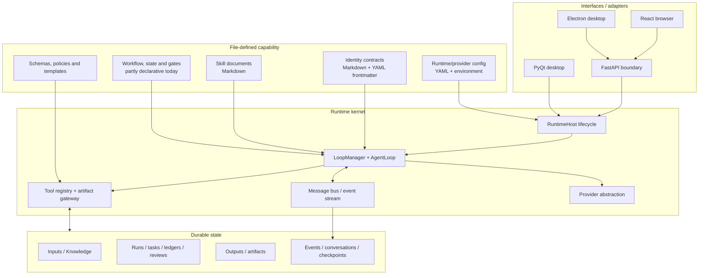

<div align="center">


# ManySelves

### One runtime. Many selves.

**A durable, file-defined runtime for portable agent capabilities.**

[](https://www.python.org/)
[](https://fastapi.tiangolo.com/)
[](#implemented-in-this-branch)
[](LICENSE)

</div>

ManySelves is an experimental, general-purpose capability substrate for AI agents. It expands the project positioning described on [csxq0605.github.io](https://csxq0605.github.io): versionable Identity contracts and Skill documents are realized through durable, recoverable execution behind a controlled runtime boundary.

The long-term objective is not another hard-coded agent application. It is to make a capability portable: give the runtime a set of Markdown/YAML definitions and durable run state, then reconstruct an agent or agent team that can execute a task, advance a serial workflow, enforce gates, pause for decisions, resume after failure, and migrate to another workspace or compatible runtime.

> **中文概览**
>
> ManySelves 希望成为一个“内核稳定、能力外置、状态可恢复”的通用 Agent 运行底座。内核负责模型调用、工具、消息、状态、检查点、权限、工作流推进和交付；身份、技能、交互规范、编排规则与门禁尽量通过 Markdown、YAML、JSON Schema 等文件定义并版本化。当前分支已经具备独立 `RuntimeHost`、FastAPI 边界、文件化 Agent 身份与 Skill、检查点/回滚、任务状态、报告工作流和多账户隔离，但还不是完全声明式、可由任意能力包驱动的无状态内核：部分路由、状态载体、工作流图和领域规则仍写在 Python 中。下文明确区分“已经实现”与“目标架构”。

## Design principles

1. **One stable kernel** — provider access, tool execution, messaging, lifecycle, workspace isolation, checkpoints, artifacts, errors, and recovery belong to the runtime.
2. **Capability outside the kernel** — identities, skills, interaction contracts, workflow topology, gates, policies, schemas, and templates should be versioned inputs.
3. **Durable state outside live workers** — progress must survive a process restart and remain inspectable, auditable, and migratable.
4. **Workflow as data** — steps, transitions, retries, human decisions, rejection paths, compensations, and terminal rules should be declared rather than compiled into one domain flow.
5. **Interfaces are adapters** — FastAPI, React, Electron, and PyQt should invoke the same runtime concepts without becoming the source of business behavior.

“Stateless kernel” here means **domain-stateless and reconstructible**, not “no live objects.” A running process still owns provider clients, queues, leases, tasks, and streams. The intended property is that no business identity or irreplaceable workflow truth exists only in those objects: a worker can be recreated from configuration, capability definitions, and persisted run state.

## Architecture



## Implemented in this branch

### Runtime boundary

`manyselves/application/runtime_host.py` owns startup, shutdown, workspace switching, message-bus lifecycle, and loop-manager replacement. The runtime is no longer inseparable from one GUI and can be hosted behind FastAPI or local interfaces.

### File-defined identities and skills

Packaged identities live under `manyselves/templates/agents/` and `manyselves/templates/reporting/agents/`. Each identity is Markdown with validated YAML frontmatter for model policy, tool grants, read/write carriers, turn limits, memory scope, background execution, and instructions. Reusable Skills live under `manyselves/templates/reporting/skills/`.

These Markdown files are **runtime inputs**, not repository documentation, so they remain after the documentation cleanup.

### Durable execution and recovery

The implementation includes project workspaces, task state, manifests, artifacts, checkpoints, rollback, resumable reporting runs, persisted decisions, conversations, and an event store. Interrupted work can be inspected or resumed instead of silently starting from zero.

### Workflow control and gates

The bundled reporting capability demonstrates serial and bounded-parallel execution, task-scoped specialist roles, evidence decisions, revision loops, cross-module review, final validation, delivery checks, and explicit terminal states. One user-facing Main agent delegates bounded work to role definitions.

### Interfaces and account isolation

- **FastAPI** exposes the server boundary and streaming events.
- **React** provides the browser client.
- **Electron** packages the browser client as a desktop surface.
- **PyQt6** remains available as the original local desktop interface.
- A FastAPI process can lazily create one isolated runtime graph and write root per configured account.

## Actual implementation versus the target substrate

| Concern | Implemented now | Target end state |
| --- | --- | --- |
| Kernel boundary | `RuntimeHost`, provider abstraction, message bus, tool registry, workspace, checkpoints, and artifacts exist. | No capability-specific route, prompt, carrier name, or workflow assumption remains in the kernel. |
| Statelessness | Durable records coexist with live `TenantRuntime`, loops, task boards, brokers, providers, and leases. | Live workers are disposable executors reconstructed from a capability package and persisted state. |
| Identity and Skills | Agent identities use Markdown/YAML frontmatter; bundled Skills are Markdown. | Identities, Skills, tool grants, interactions, schemas, and compatibility requirements share one versioned capability manifest. |
| Orchestration | The report workflow supports state, gates, resume, revision, review, and delivery, but much of its graph and transition logic is Python. | Serial/parallel steps, retries, decisions, gates, compensations, and terminal rules load from declarative definitions. |
| Capability loading | The runtime loads packaged identities and known templates. | An arbitrary validated capability bundle can be installed, selected, and instantiated without capability-specific kernel edits. |
| Domain coupling | Reporting-specific routing, fixed carrier vocabulary, and domain services still appear in core paths. | Domain packages register vocabulary and behavior through stable extension points. |
| State model | Checkpoints, conversations, event storage, artifacts, and workflow records cover important recovery paths. | One typed state/event contract supports replay, migration, inspection, and compatibility checks. |
| Task migration | Definitions and templates can be copied and project data remains durable. | A capability plus its run state can move to another compatible runtime without moving domain-specific Python code. |

The repository therefore contains a useful runtime and a substantial reference capability, but it is not yet a fully generic, zero-code workflow engine.

## Target capability package

The following layout expresses the intended direction. It is a target contract, **not a claim that every field is currently accepted by the loader**.

```text
capabilities/example/
├── capability.yaml
├── identities/
│   ├── main.md
│   ├── executor.md
│   └── reviewer.md
├── skills/
│   ├── analysis.md
│   └── delivery.md
├── workflows/
│   └── default.yaml
├── policies/
│   ├── access.yaml
│   └── gates.yaml
├── schemas/
│   ├── input.schema.json
│   ├── state.schema.json
│   └── output.schema.json
└── templates/
    └── deliverable.docx
```

A future workflow definition could look like this:

```yaml
apiVersion: manyselves/v1
kind: Capability
metadata:
  id: portable-research-workflow
  version: 1.0.0

entrypoint: main
identities:
  main: identities/main.md
  executor: identities/executor.md
  reviewer: identities/reviewer.md

workflow:
  stateSchema: schemas/state.schema.json
  steps:
    - id: execute
      agent: executor
      skills: [skills/analysis.md]
      writes: [work/result.json]

    - id: review
      needs: [execute]
      agent: reviewer
      gate:
        type: schema-and-policy
        schema: schemas/output.schema.json
        onReject: execute

    - id: deliver
      needs: [review]
      run: tools.render
      terminal: true
```

The portability rule is simple: **definitions describe capability; durable state describes progress; the kernel interprets stable contracts.**

## Bundled reference capability

The most complete current capability is a power-distribution report workflow. It coordinates evidence intake, specialist analysis, review, revision, final assembly, and DOCX delivery while preserving run state and decisions.

A project workspace normally contains:

```text
project/
├── Inputs/       # Task facts and uploaded source material
├── Knowledge/    # Reusable references
├── Templates/    # Optional delivery templates
├── Work/         # Runs, state, ledgers, reviews and checkpoints
└── Outputs/      # Modules, reports and final artifacts
```

It should be treated as a proving ground for the runtime, not as the permanent boundary of ManySelves.

## Repository layout

```text
manyselves/
├── application/        # RuntimeHost and application services
├── core/               # Loops, providers, tools, state and bundled workflow
├── webapi/             # FastAPI, auth, events and account runtimes
├── gui/                # PyQt client
├── interfaces/         # Shared runtime-facing types
└── templates/          # Runtime-loaded Identity, Skill and delivery files

frontend/               # React client
desktop/                # Electron client
frontend-contract/      # Generated OpenAPI contract
deploy/                 # Compose and deployment configuration
docs/                   # Configuration and running instructions only
```

## Quick start

Requirements: Python 3.12+, [`uv`](https://docs.astral.sh/uv/), a supported model-provider key, and Node.js 22+ when building React/Electron.

### PyQt desktop

```bash
git clone --branch feature/react-fastapi-manyselves \
  https://github.com/csxq0605/manyselves.git
cd manyselves

uv sync
cp manyselves.config.example.yaml manyselves.config.yaml
uv run manyselves
```

### React + FastAPI

```bash
cp .env.example .env
# Replace example credentials and provider settings.
./start.sh
```

API-focused development:

```bash
uv sync
npm --prefix frontend install
npm --prefix frontend run build
uv run python run_web.py --reload --host 127.0.0.1 --port 9090
```

Open `http://127.0.0.1:9090`; OpenAPI documentation is available at `/docs`.

### Docker Compose

```bash
cp deploy/env.example deploy/.env
chmod 600 deploy/.env
# Replace the password and configure the exact browser origin.

docker compose -f deploy/compose.yaml --env-file deploy/.env config
docker compose -f deploy/compose.yaml --env-file deploy/.env up -d --build --wait
```

See [Running ManySelves](docs/RUNNING.md) for Electron, multi-account mode, health checks, verification, backup, restore, and troubleshooting.

## Configuration

- [Configuration](docs/CONFIGURATION.md) covers providers, environment variables, account manifests, state locations, and the current Identity frontmatter schema.
- `manyselves.config.example.yaml` is the local runtime template.
- `.env.example` and `deploy/env.example` are local and Compose environment templates.
- `deploy/accounts.example.yaml` is the multi-account manifest template.

Do not commit real API keys, passwords, active `.env` files, or account manifests.

## Development

```bash
uv sync
QT_QPA_PLATFORM=offscreen uv run pytest -q
uv run ruff check manyselves tests scripts
npm --prefix frontend run verify
npm --prefix desktop run verify
```

Changes should preserve the distinction between runtime contracts, capability definitions, persisted task state, and interface-specific behavior.

## Project status

ManySelves is an active experimental system. The general capability-package contract is still evolving; pin the repository revision and capability definitions used by any deployed task.

## License

MIT License — Copyright (c) 2026 ManySelves contributors.
