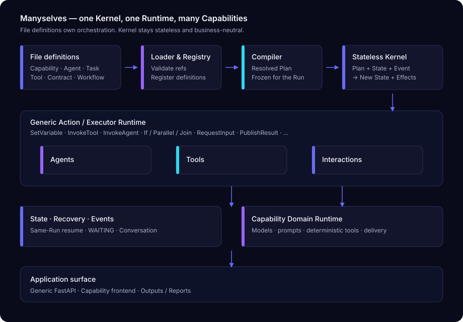

<div align="center">


### One runtime. Many selves.

**由文档定义 Agent 团队的本地工作空间**

[](#)
[](https://www.python.org/)
[](https://www.riverbankcomputing.com/software/pyqt/)
[](LICENSE)

[English](README.md) | 中文

</div>

## 理念

Manyselves 的出发点是：**Agent 团队的边界应写在文档里，而不是再写一个应用。**

换一套身份、技能与交接定义，同一套运行时可以变成另一支团队。运行时只负责稳定的通用部分——会话、文件、路由、检查点、Provider 与产物；业务编排与角色语义由 Capability 文件定义拥有。

> **One runtime. Many selves.**

---

## 设计原则

1. **文件定义驱动**  
   Capability、Agent、Task、Tool、Contract、Workflow、Recovery 以 Markdown / YAML / Schema 声明；流程在文件里，不散落在私有 `if/for` 编排里。

2. **无状态 Kernel + 通用 Compiler/Runtime**  
   只有一套编译与执行语义：

   ```text
   Plan + State + Event  →  New State + Effects
   ```

   Kernel 不认识 Provider、报告章节或任何业务字段；每个 Capability 不得复制第二套状态机。

3. **Capability 拥有领域实现**  
   领域模型、校验、Agent 提示、确定性 Tool、渲染与交付归 Capability；通用层只调度。

4. **可恢复、可观测**  
   同一 Run 可 WAITING / 恢复；Conversation、Tool 结果、事件与产物可追溯。

5. **用户只面对 Main**  
   专家、审计、复核、编辑在同一时间线协作；用户用自然语言说明目标。

完整规范见 [`docs/PROJECT_POSITIONING.md`](docs/PROJECT_POSITIONING.md) 与 [`AGENTS.md`](AGENTS.md)。

---

## 系统形态



---

## 仓库内容

| 路径 | 内容 |
|---|---|
| `manyselves/kernel/` | 无状态 Kernel：定义、合同、编译结果、纯状态转换、端口 |
| `manyselves/runtime/` | 通用 Agent/Tool/Conversation/Interaction/Recovery/Event 执行 |
| `manyselves/capabilities/` | Capability 包（当前含 `distribution_reporting`） |
| `manyselves/application/` | 通用 Capability/Workflow/Run 生命周期 |
| `manyselves/webapi/` | 通用 FastAPI |
| `frontend/` | 由 State/Event/Output 投影驱动的 Capability 专属 React 产品前端 |
| `manyselves/templates/` | Agent 身份与报告 Skill 文档 |
| `docs/` | 定位、架构、部署与内部实施状态（见 [docs/README.md](docs/README.md)） |

### 内置 Capability：配电报告

仓库内置一支可运行的配电安全报告团队：证据入库 → 五模块协作 → 责任审查 → Cross/Chief → Final → Word/索引交付，并支持对已有完整报告做**定向修订**（含影响分析 `impact_mode=auto|confirm`）。

它是「运行时能承载什么」的示例，不是产品边界。换定义即可变成其他团队。

---

## 通用运行时能力

- **一个 Main 入口** — 用户只和 Main 对话
- **本地项目工作区** — 输入、知识、状态、输出都在项目目录
- **文档上下文** — 预览、`@` 引用、Markdown 渲染
- **可靠执行** — 流式、检查点、同 Run 恢复
- **多 Provider** — Anthropic、OpenAI、DeepSeek 及兼容 API
- **可扩展交付** — 文档、复核记录、台账、状态快照

---

## 快速开始

需要 Python 3.12+、[uv](https://docs.astral.sh/uv/) 和至少一个 Provider API Key。

```bash
git clone <repository-url> manyselves
cd manyselves
uv sync
uv run manyselves          # 桌面端
```

本地 Web：

```bash
.venv\Scripts\python.exe run_web.py --host 127.0.0.1 --port 9092 --data-dir <工作目录>
```

配置固定为仓库根目录 `manyselves.config.yaml`。

日常操作（六种报告操作、修订、默认参数）见 **[操作手册](docs/OPERATION_MANUAL.md)**。

---

## 文档

| 用途 | 文档 |
|---|---|
| 操作手册 | [docs/OPERATION_MANUAL.md](docs/OPERATION_MANUAL.md) |
| 产品与架构定位 | [docs/PROJECT_POSITIONING.md](docs/PROJECT_POSITIONING.md) |
| 架构收敛方案 | [docs/architecture/AI_NATIVE_RUNTIME_EXTRACTION_PLAN.md](docs/architecture/AI_NATIVE_RUNTIME_EXTRACTION_PLAN.md) |
| 架构约定（开发/Agent） | [AGENTS.md](AGENTS.md) |
| 文档总索引 | [docs/README.md](docs/README.md) |

---

## License

MIT，见 [LICENSE](LICENSE)。
