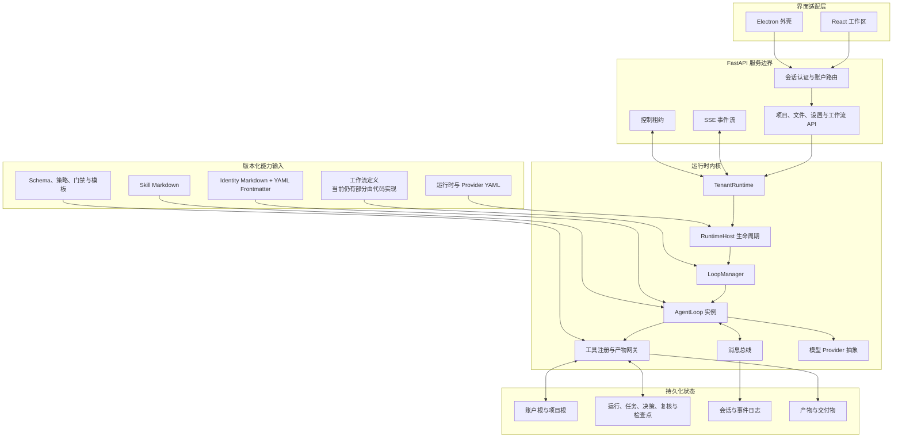

<div align="center">


# ManySelves

### 文件定义 Agent，持久化工作流，可替换运行 Worker。

[](https://www.python.org/)
[](https://fastapi.tiangolo.com/)
[](https://react.dev/)
[](https://www.electronjs.org/)
[](LICENSE)

[English](README.md) | 简体中文

</div>

ManySelves 是一个将**运行基础设施**与 **Agent 能力定义**分离的多智能体运行时。运行时负责模型 Provider、工具、消息、任务状态、检查点、工作流门禁、项目隔离、事件流和产物；Agent 身份、Skill、配置、交互契约以及逐步外置的编排规则，则通过可版本管理的 Markdown、YAML 和 Schema 文件输入。

整体架构方向是构建一个**领域无状态、可重建的内核**：运行中的 Worker 可以保留队列、客户端、租约和 Loop 等实时对象，但业务身份与权威工作流进度必须能够由“定义文件 + 持久化状态”重新构建。这样，同一个任务可以恢复、检查、版本化和迁移，而不需要重新开发一个绑定特定领域的应用。

## 技术设计

ManySelves 按四个边界组织：

1. **运行时内核**：生命周期、模型调用、工具、消息、任务执行、检查点、异常、恢复和产物访问；
2. **能力定义**：Identity、Skill、输入输出契约、策略、门禁、工作流拓扑、Schema 和模板；
3. **持久化状态**：项目、会话、事件、任务记录、决策、复核、检查点与输出；
4. **界面适配层**：React、Electron 和 FastAPI 对外暴露运行时，但不承载领域业务逻辑。

当前实现已经将 Identity 与 Skill 文件化，并持久化了主要任务记录。部分工作流拓扑、状态迁移和领域服务仍由 Python 实现；后续会继续将这些规则迁移到经过校验的能力包中。

## 架构



### 运行时内核

`manyselves/application/runtime_host.py` 负责运行时启动、停止、工作区切换、消息总线生命周期和 LoopManager 替换。`LoopManager` 创建并协调 `AgentLoop`；Provider 与工具抽象将模型调用和工作区操作隔离在稳定接口之后。

FastAPI 层负责选择正确的账户运行时，暴露项目与工作流操作，并向前端推送运行事件。React 通过同一套 API 使用运行时，Electron 仅封装 Web 工作区，不再维护另一套业务实现。

### 定义层

Agent Identity 使用带 YAML Frontmatter 的 Markdown 文件。一个身份定义可以约束模型策略、工具授权、可读写载体、轮次与 Token 上限、记忆范围、后台执行和完整指令。

```markdown
---
name: reviewer
description: Review one result against evidence and policy.
model: inherit
tools: [read]
disallowedTools: [delete_file]
maxTurns: 8
maxTokens: 16384
effort: high
memory: task
background: true
reads: [module_drafts, claim_ledger]
writes: [review_findings]
---

Review the assigned result and return a structured finding record.
```

可复用的方法与质量标准以 Skill Markdown 存储；运行时与 Provider 配置通过 YAML 和环境变量输入。这些文件是运行时会加载的可执行输入，不是普通设计文档。

当前定义主要位于：

```text
manyselves/templates/agents/
manyselves/templates/reporting/agents/
manyselves/templates/reporting/skills/
ProductCapabilities/skills/
```

### 执行生命周期

一个典型任务按照以下路径运行：

1. 完成认证并解析账户运行时；
2. 解析项目与能力定义；
3. 校验 Identity、工具权限、读写载体、模型配置和任务输入；
4. 创建或恢复工作流运行及其权威状态；
5. 通过 `LoopManager` 和 `AgentLoop` 执行指定 Agent；
6. 持久化消息、工具结果、任务迁移、决策和检查点；
7. 在进入下一步骤前执行工作流门禁；
8. 通过受控项目路径生成产物；
9. 中断后依据持久化状态继续，而不是只根据聊天上下文猜测任务进度。

## 状态、权限与隔离

### 持久化项目状态

项目通常使用以下目录边界：

```text
project/
├── Inputs/       # 任务输入与上传资料
├── Knowledge/    # 可复用参考资料
├── Templates/    # 可选交付模板
├── Work/         # 运行、状态、台账、复核、决策和检查点
└── Outputs/      # 生成产物与交付物
```

`Work/` 是权威任务状态，不是临时文档。任务需要恢复、审计、回滚或迁移时，必须保留该目录。

### 账户隔离

单账户与多账户模式使用同一个 HTTP 服务契约。多账户模式下，登录账户会选择独立运行时对象图和写入根：

```text
<data-root>/accounts/<account-id>/
```

每个账户分别拥有 RuntimeHost、Provider 配置、项目注册表、事件 Broker、控制租约、工作流状态和 API Key。多账户服务使用单个进程 Worker，由服务内部显式完成账户运行时路由。

### 权限模型

权限控制由以下机制共同完成：

- Identity 级工具允许与禁止列表；
- 具名可读、可写载体；
- 账户根和项目根隔离；
- API 认证与账户路由；
- 写操作控制租约；
- 工作流推进前的版本与门禁校验；
- 不向浏览器返回的服务端密钥。

后续会将文件范围、门禁策略和工作流权限统一放入经过校验的 Capability Manifest，而具体执行仍由内核负责。

## 当前实现边界与演进方向

| 关注点 | 当前机制 | 演进方向 |
| --- | --- | --- |
| Identity | Markdown + 经过校验的 YAML Frontmatter | 由统一能力清单引用并进行版本管理的身份契约 |
| Skill | 由已知能力加载 Markdown | 显式声明 Skill 依赖、版本、作用域与兼容性元数据 |
| 编排 | 持久化工作流状态，迁移和门禁主要由 Python 定义 | 声明式串并行步骤、重试、决策、驳回路径和终态规则 |
| 状态 | 项目记录、会话、事件、检查点、决策、复核和产物 | 支持重放与迁移的统一类型化 State/Event 契约 |
| 能力加载 | 加载内置 Identity、Skill、模板和已知工作流服务 | 无需修改内核即可安装并实例化经过校验的能力包 |
| Worker | 运行时存在 `TenantRuntime`、Loop、Provider、队列、Broker 和 Lease | Worker 可由定义和权威状态重新构建并替换 |
| 领域耦合 | 部分报告载体、路由和服务仍位于 Python | 领域词汇与行为通过稳定扩展契约注册 |

“无状态化内核”并不是要求运行进程没有内存，而是要求实时对象可以替换，且不能成为业务身份或工作流事实的唯一存储位置。

## 目标能力包

下面的目录是目标中的可迁移能力契约。它描述架构方向，不表示当前 Loader 已经支持全部字段。

```text
capabilities/example/
├── capability.yaml
├── identities/
│   ├── main.md
│   ├── executor.md
│   └── reviewer.md
├── skills/
│   ├── analysis.md
│   └── delivery.md
├── workflows/
│   └── default.yaml
├── policies/
│   ├── access.yaml
│   └── gates.yaml
├── schemas/
│   ├── input.schema.json
│   ├── state.schema.json
│   └── output.schema.json
└── templates/
    └── deliverable.docx
```

工作流定义可以采用类似结构：

```yaml
apiVersion: manyselves/v1
kind: Capability
metadata:
  id: portable-research-workflow
  version: 1.0.0

entrypoint: main
identities:
  main: identities/main.md
  executor: identities/executor.md
  reviewer: identities/reviewer.md

workflow:
  stateSchema: schemas/state.schema.json
  steps:
    - id: execute
      agent: executor
      skills: [skills/analysis.md]
      writes: [work/result.json]

    - id: review
      needs: [execute]
      agent: reviewer
      gate:
        type: schema-and-policy
        schema: schemas/output.schema.json
        onReject: execute

    - id: deliver
      needs: [review]
      run: tools.render
      terminal: true
```

任务迁移的基本规则是：**定义文件描述能力，持久化状态描述进度，内核解释稳定契约。**

## 运行场景 Demo：配电安全与报告

仓库中的配电相关内容是一个**运行场景 Demo**，不是 ManySelves 内核的业务边界。该场景用于覆盖一条包含证据处理、专业角色、结构化复核、返修门禁和文档交付的完整执行链路。

Demo 主要验证：

- 源文件接入与证据索引；
- 专业 Identity 的任务路由；
- 缺资决策与工作流状态持久化；
- 模块生成、责任复核、返修、复查和跨模块审查；
- 最终整合与 DOCX 产物生成；
- 证据、Skill、模板、复核和报告版本的来源记录。

配电场景中的 Identity、Skill、载体和领域工作流服务会逐步迁移到能力包边界，使其他场景能够替换该 Demo，而无需修改运行时内核。

## 仓库结构

```text
manyselves/
├── application/        # RuntimeHost 与应用服务
├── core/               # Loop、Provider、工具、状态与工作流服务
├── webapi/             # FastAPI、认证、账户路由与 SSE
├── interfaces/         # 共用运行时接口契约
└── templates/          # 运行时加载的 Identity、Skill 和模板

frontend/               # React 工作区
desktop/                # Electron 外壳
frontend-contract/      # 生成的 OpenAPI 契约
deploy/                 # Compose、镜像、账户示例与备份脚本
docs/                   # 配置与运行说明
```

## 本地运行

### 环境要求

- Python 3.12+
- [`uv`](https://docs.astral.sh/uv/)
- Node.js 22+ 与 npm
- 至少一个受支持的模型 Provider API Key

克隆默认分支：

```bash
git clone https://github.com/csxq0605/manyselves.git
cd manyselves
```

### Linux/macOS

```bash
cp .env.example .env
# 编辑 .env：替换管理员密码，并配置模型 Provider Key。

chmod +x start.sh
./start.sh
```

### Windows

```bat
copy .env.example .env
rem 启动前编辑 .env。

npm --prefix frontend install
npm --prefix frontend run build
scripts\start.bat
```

启动后访问：

```text
应用地址：       http://127.0.0.1:9090
OpenAPI 文档：   http://127.0.0.1:9090/docs
存活检查：       http://127.0.0.1:9090/api/v1/health/live
就绪检查：       http://127.0.0.1:9090/api/v1/health/ready
```

仅进行 API 或前端联调时：

```bash
uv sync
npm --prefix frontend install
npm --prefix frontend run build

uv run python run_web.py \
  --reload \
  --host 127.0.0.1 \
  --port 9090 \
  --data-dir .manyselves
```

## Docker Compose 部署

```bash
cp deploy/env.example deploy/.env
chmod 600 deploy/.env
```

至少在 `deploy/.env` 中设置管理员密码、持久化数据目录和准确的浏览器来源：

```dotenv
MANYSELVES_ADMIN_PASSWORD=replace-with-a-long-random-password
MANYSELVES_DATA_DIR=/srv/manyselves/data
MANYSELVES_ALLOWED_ORIGINS=["https://manyselves.example.com"]
```

校验并启动：

```bash
docker compose -f deploy/compose.yaml --env-file deploy/.env config

docker compose -f deploy/compose.yaml --env-file deploy/.env \
  up -d --build --wait
```

查看或停止：

```bash
docker compose -f deploy/compose.yaml --env-file deploy/.env ps

docker compose -f deploy/compose.yaml --env-file deploy/.env \
  logs -f --tail 200 api web

docker compose -f deploy/compose.yaml --env-file deploy/.env down
```

验证服务：

```bash
curl --fail http://127.0.0.1:9090/api/v1/health/live
curl --fail http://127.0.0.1:9090/api/v1/health/ready

set -a
. deploy/.env
set +a

uv run python scripts/verify_deployment.py \
  --url http://127.0.0.1:9090 \
  --username "$MANYSELVES_ADMIN_USERNAME" \
  --password-env MANYSELVES_ADMIN_PASSWORD
```

Electron、多账户模式、环境变量更新、备份恢复和故障排查见 [ManySelves 运行说明](docs/RUNNING.md)。

## 配置说明

- [配置说明](docs/CONFIGURATION.md)：Provider、环境变量、账户清单、状态路径、Identity Frontmatter 和密钥；
- [运行说明](docs/RUNNING.md)：本地启动、Electron、Compose、验证、备份、恢复和日常操作；
- `manyselves.config.example.yaml`：运行时与 Provider 配置模板；
- `.env.example`：本地 FastAPI 环境变量模板；
- `deploy/env.example`：Compose 环境变量模板；
- `deploy/accounts.example.yaml`：多账户清单模板。

不要提交真实 API Key、密码、正在使用的 `.env`、包含密钥的运行时配置或账户清单。

## 开发检查

```bash
uv sync
uv run pytest -q
uv run ruff check manyselves tests scripts
npm --prefix frontend run verify
npm --prefix desktop run verify
```

后续修改应继续保持运行时内核契约、能力定义、权威任务状态和界面适配层之间的边界。

## License

MIT License — Copyright (c) 2026 ManySelves contributors.
