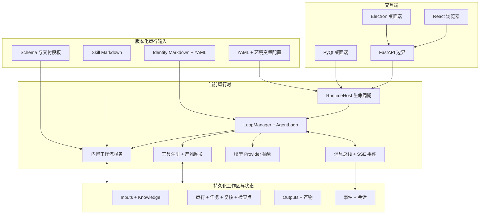

<div align="center">


# ManySelves

### One runtime. Many selves.

**一个已经上线、由文件定义 Agent 团队并承载持久化工作流的多智能体运行系统。**

[](https://www.python.org/)
[](https://fastapi.tiangolo.com/)
[](#当前版本已经具备的能力)
[](#版本状态)
[](LICENSE)

[English](README.md) | 简体中文

</div>

ManySelves 是一套已经部署上线的多 Agent 运行系统。它将可版本管理的 **Identity 身份文档**和 **Skill 能力文档**转化为可执行的 Agent 团队，并由运行时提供模型接入、工具执行、消息传递、项目工作区、任务状态、检查点、质量门禁、故障恢复和交付物生成等通用能力。

当前版本可以通过 PyQt、React + FastAPI 或 Electron 使用。仓库内置的配电报告能力是目前最完整的生产能力实现，同时也作为通用运行时持续演进的参考实现；它不是 ManySelves 永久的业务边界。

> **无状态化内核是后续最终目标，不是当前版本状态**
>
> “领域无状态、可重建的内核”是 ManySelves 后续的最终架构方向。当前上线版本已经将大量 Agent 身份与 Skill 拆分为文件，并持久化了关键任务状态，但部分工作流图、状态迁移规则和领域服务仍由 Python 实现。这个演进方向会在后文单独说明，不改变当前已上线版本的 Production/Stable 定位。

## 立即本地运行或部署

### 1. 克隆当前维护分支

```bash
git clone --branch feature/react-fastapi-manyselves \
  https://github.com/csxq0605/manyselves.git
cd manyselves
```

### 2. 本地 Web：React + FastAPI

Linux/macOS：

```bash
cp .env.example .env
# 编辑 .env：替换管理员密码，并配置至少一个模型 Provider Key。

chmod +x start.sh
./start.sh
```

Windows 命令提示符或 PowerShell：

```bat
copy .env.example .env
rem 编辑 .env。Windows 下 MANYSELVES_ALLOWED_ORIGINS 请写成：
rem MANYSELVES_ALLOWED_ORIGINS=["http://127.0.0.1:9090"]

npm --prefix frontend install
npm --prefix frontend run build
scripts\start.bat
```

启动后访问：

```text
应用地址：       http://127.0.0.1:9090
OpenAPI 文档：   http://127.0.0.1:9090/docs
存活检查：       http://127.0.0.1:9090/api/v1/health/live
就绪检查：       http://127.0.0.1:9090/api/v1/health/ready
```

只进行 API 或前端联调时，可以显式启动：

```bash
uv sync
npm --prefix frontend install
npm --prefix frontend run build

uv run python run_web.py \
  --reload \
  --host 127.0.0.1 \
  --port 9090 \
  --data-dir .manyselves
```

### 3. 本地桌面端：PyQt

```bash
uv sync
cp manyselves.config.example.yaml manyselves.config.yaml
uv run manyselves
```

Provider 可以在应用内设置，也可以通过支持的环境变量配置。未设置 Provider Key 时仍可打开工作区，但真正调用模型时必须存在已启用的 Provider。

### 4. 服务器部署：Docker Compose

先准备部署环境文件：

```bash
cp deploy/env.example deploy/.env
chmod 600 deploy/.env
```

启动前至少修改以下内容：

```dotenv
MANYSELVES_ADMIN_PASSWORD=replace-with-a-long-random-password
MANYSELVES_DATA_DIR=/absolute/path/to/persistent-data
MANYSELVES_ALLOWED_ORIGINS=["https://your-manyselves-domain.example"]
```

如果服务器不是通过只监听回环地址的反向代理提供服务，还需要设置合适的监听地址：

```dotenv
MANYSELVES_HTTP_BIND=0.0.0.0
MANYSELVES_HTTP_PORT=9090
```

启动：

```bash
docker compose -f deploy/compose.yaml --env-file deploy/.env config
docker compose -f deploy/compose.yaml --env-file deploy/.env \
  up -d --build --wait
```

查看状态、日志或停止：

```bash
docker compose -f deploy/compose.yaml --env-file deploy/.env ps
docker compose -f deploy/compose.yaml --env-file deploy/.env \
  logs -f --tail 200 api web
docker compose -f deploy/compose.yaml --env-file deploy/.env down
```

检查 HTTP 服务：

```bash
curl --fail http://127.0.0.1:9090/api/v1/health/live
curl --fail http://127.0.0.1:9090/api/v1/health/ready
```

执行带登录、文件往返、SSE 和产物下载的公共 API 验证：

```bash
uv sync
set -a
. deploy/.env
set +a

uv run python scripts/verify_deployment.py \
  --url http://127.0.0.1:9090 \
  --username "$MANYSELVES_ADMIN_USERNAME" \
  --password-env MANYSELVES_ADMIN_PASSWORD
```

Electron、多账户模式、备份恢复和故障排查见 [ManySelves 运行说明](docs/RUNNING.md)。

## 当前版本已经具备的能力

### 同一运行时支持多个交互端

- **FastAPI** 提供运行时边界、身份认证、项目、文件、设置、控制操作、报告接口和 SSE 事件流；
- **React** 提供浏览器工作空间；
- **Electron** 将浏览器客户端封装为桌面应用；
- **PyQt6** 保留原有的本地桌面入口；
- 各界面应调用相同的运行时能力，而不是分别实现一套业务规则。

### 文件化 Identity 与 Skill

已打包的 Agent 身份位于：

```text
manyselves/templates/agents/
manyselves/templates/reporting/agents/
```

Identity 使用 Markdown 正文和 YAML Frontmatter，描述角色策略、模型策略、工具授权、可读写载体、最大轮次、记忆范围、后台执行和完整指令。

可复用 Skill 位于：

```text
manyselves/templates/reporting/skills/
ProductCapabilities/skills/
```

这些 Markdown 文件是运行时会读取的能力输入，不是普通仓库说明文档，因此在文档清理后仍然保留。

### 持久化任务执行

当前实现包括：

- 项目工作区和受控文件访问；
- 任务看板、运行状态、Manifest、台账、复核记录和决策记录；
- 内容寻址产物和生成式交付物；
- 检查点、回滚、可恢复执行和交付后修订；
- 会话与持久化事件日志；
- OpenAI 兼容协议和 Anthropic 兼容协议的 Provider 抽象；
- 等待、阻塞、返修、驳回、失败和完成等明确状态。

### 工作流控制与质量门禁

内置报告运行时已经验证了串行与有界并行两类执行方式：

- 用户只面对一个 Main Agent，由 Main 拆解和委派有边界的任务；
- 专业 Agent 根据明确输入和输出载体执行；
- 证据就绪状态和缺资决策会被持久化；
- 模块审查、定向返修、原审查者复核、跨模块审查、最终检查和交付检查均设置门禁；
- 中断后的运行可以查看并恢复，而不是静默从头开始；
- 最终产物保留来源、模板、Skill 和版本信息。

### 账户隔离

FastAPI 可以运行在单账户或多账户模式。多账户模式下，登录账户会选择独立的运行时对象图、Provider 配置、事件 Broker、控制租约、项目根目录和持久化写入根目录。

## 当前运行架构



`manyselves/application/runtime_host.py` 负责启动、停止、工作区切换、消息总线生命周期和 LoopManager 替换。FastAPI 账户层负责选择或创建正确的账户运行时，项目文件与运行记录构成持久化任务边界。

## 最终架构目标：领域无状态内核

后续最终目标是让内核保持稳定且不绑定具体业务，把身份、交互、编排、状态 Schema、门禁和领域行为进一步放入可版本管理的能力包。

这里的“无状态化内核”是指 **领域无状态且可以重建**，不是运行进程中没有任何内存对象。正在运行的 Worker 仍然会持有 Provider Client、队列、租约、任务和事件流；真正需要保证的是，业务身份和不可替代的工作流事实不能只存在于这些对象里。Worker 应当能够依据运行配置、能力定义和持久化运行状态重新构建。

最终目标遵循以下原则：

1. **稳定内核**：模型调用、工具、消息、生命周期、工作区隔离、检查点、产物、错误和恢复由运行时负责；
2. **能力外置**：Identity、Skill、交互规范、工作流拓扑、门禁、策略、Schema 和模板成为版本化输入；
3. **权威状态持久化**：任务进度可以跨进程恢复，并支持查看、重放、审计和迁移；
4. **工作流即数据**：步骤、依赖、状态迁移、重试、人工决策、驳回路径、补偿和终态规则由文件声明；
5. **任务可迁移**：能力包与兼容的运行状态可以迁移到其他工作区或兼容的 ManySelves 内核。

### 当前生产版本与最终目标的差异

| 关注点 | 当前生产版本 | 最终架构目标 |
| --- | --- | --- |
| 运行时边界 | 已拆分 `RuntimeHost`、Provider、消息总线、工具、工作区、检查点、产物和 API 适配层。 | 内核中不再包含具体能力的路由、Prompt、载体名称或工作流假设。 |
| 内存状态 | `TenantRuntime`、Loop、Broker、Provider、Lease 和任务看板在运行期间存在于内存，同时关键记录已持久化。 | 内存 Worker 是可丢弃执行器，可以完全由定义文件和持久化状态重建。 |
| Identity 与 Skill | Agent 身份使用 Markdown/YAML Frontmatter，内置 Skill 使用 Markdown。 | 使用统一 Capability Manifest 版本化身份、Skill、交互、授权、Schema 和兼容性要求。 |
| 编排方式 | 已上线报告工作流支持恢复、返修、复核、交付、门禁和有界并行，但大量拓扑仍由 Python 实现。 | 串并行拓扑、状态迁移、重试、门禁和补偿规则从声明式工作流文件加载。 |
| 能力加载 | 当前运行时会加载内置身份和已知报告定义。 | 任意通过校验且兼容的能力包都能安装和实例化，无需修改领域专用内核代码。 |
| 状态与迁移 | 项目、事件、会话、检查点、运行记录和产物已覆盖大量恢复场景。 | 统一的类型化 State/Event 契约支持重放、迁移、兼容性检查和 Worker 替换。 |
| 任务可移植性 | 定义文件和项目数据可以复制，但部分领域 Python 仍需随仓库迁移。 | 仅凭能力定义和运行状态即可在兼容运行时继续任务。 |

### 目标能力包

下面是后续能力包的目标契约示例，不表示当前 Loader 已经支持其中全部字段：

```text
capabilities/example/
├── capability.yaml
├── identities/
│   ├── main.md
│   ├── executor.md
│   └── reviewer.md
├── skills/
│   ├── analysis.md
│   └── delivery.md
├── workflows/
│   └── default.yaml
├── policies/
│   ├── access.yaml
│   └── gates.yaml
├── schemas/
│   ├── input.schema.json
│   ├── state.schema.json
│   └── output.schema.json
└── templates/
    └── deliverable.docx
```

未来的工作流定义可以采用类似结构：

```yaml
apiVersion: manyselves/v1
kind: Capability
metadata:
  id: portable-research-workflow
  version: 1.0.0

entrypoint: main

identities:
  main: identities/main.md
  executor: identities/executor.md
  reviewer: identities/reviewer.md

workflow:
  stateSchema: schemas/state.schema.json
  steps:
    - id: execute
      agent: executor
      skills: [skills/analysis.md]
      writes: [work/result.json]

    - id: review
      needs: [execute]
      agent: reviewer
      gate:
        type: schema-and-policy
        schema: schemas/output.schema.json
        onReject: execute

    - id: deliver
      needs: [review]
      run: tools.render
      terminal: true
```

任务迁移的基本规则是：**定义文件描述能力，持久化状态描述进度，内核解释稳定契约。**

## 内置参考能力

当前最完整的能力是配电报告工作流。它负责资料接入、专家分析、复核、返修、最终整合和 DOCX 交付，并持久化运行状态、证据决策和产物来源信息。

典型项目工作区包括：

```text
项目/
├── Inputs/       # 任务事实和上传资料
├── Knowledge/    # 可复用参考资料
├── Templates/    # 可选交付模板
├── Work/         # 运行、状态、台账、复核、决策和检查点
└── Outputs/      # 模块稿、报告和最终产物
```

该能力本身已经是上线功能，同时也承担通用运行时契约的参考实现和验证场景。

## 仓库结构

```text
manyselves/
├── application/        # RuntimeHost 与应用服务
├── core/               # Loop、Provider、工具、状态与内置工作流
├── webapi/             # FastAPI、认证、事件和账户运行时
├── gui/                # PyQt 客户端
├── interfaces/         # 共用运行时接口类型
└── templates/          # 运行时读取的 Identity、Skill 和交付文件

frontend/               # React 客户端
desktop/                # Electron 客户端
frontend-contract/      # 生成的 OpenAPI 契约
deploy/                 # Compose 与部署配置
docs/                   # 配置与启动运行说明
```

## 配置与运行文档

- [配置说明](docs/CONFIGURATION.md)：Provider、环境变量、账户清单、状态目录和当前 Identity Frontmatter Schema；
- [运行说明](docs/RUNNING.md)：所有启动方式、健康检查、部署验证、备份恢复和故障排查；
- `manyselves.config.example.yaml`：本地运行时配置模板；
- `.env.example`：本地 Web 环境变量模板；
- `deploy/env.example`：Compose 部署环境变量模板；
- `deploy/accounts.example.yaml`：多账户清单模板。

不要提交真实 API Key、密码、正在使用的 `.env` 或账户清单。

## 开发与验证

```bash
uv sync
QT_QPA_PLATFORM=offscreen uv run pytest -q
uv run ruff check manyselves tests scripts
npm --prefix frontend run verify
npm --prefix desktop run verify
```

后续修改应继续区分运行时契约、能力定义、持久化任务状态和界面适配逻辑。

## 版本状态

当前 ManySelves 版本已经部署上线，并按 **Production/Stable** 维护。上文中的 PyQt、React + FastAPI、Electron、项目工作区、报告工作流、恢复能力和账户隔离均属于当前实际实现。

通用能力包契约和领域无状态化内核是继续演进的架构目标。它们是对当前上线系统的扩展路线，而不是判定当前版本是否稳定的前置条件。

## License

MIT License — Copyright (c) 2026 ManySelves contributors.
