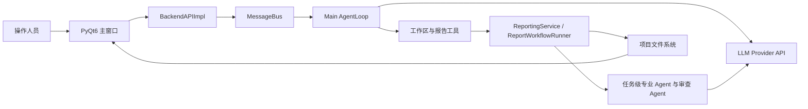
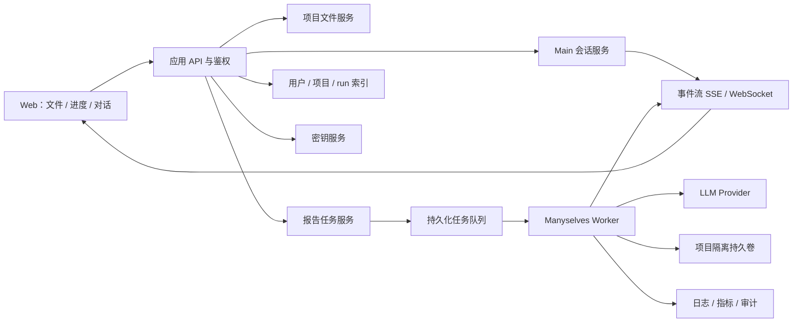

# Manyselves 项目说明与产品化服务评审稿

> 文档状态：供产品、研发、运维和家威共同评审
>
> 原始评审核对基线：2026-07-29，`main@25b5350`
>
> 当前实验架构：2026-08-12，`cost-control-experiments` 已单向包含 `main`；旧三波、
> 37 叶协作只保留为历史审计证据。当前运行路径固定为五个模块 Editor/Auditor lane
> 与五个模块级 Cross owner，经双 barrier 后串行进入 Chief、Final 和 Delivery。
> 交接和实施边界见
> [`experimental-cost-control-handoff.md`](experimental-cost-control-handoff.md)。
>
> 目标方向：把当前桌面运行时改造成产品化服务；最终业务界面只保留文件、进度、对话三块。
>
> 说明：本文严格区分当前代码、已确定目标和待实现内容，不把产品化方案写成已完成能力。

## 1. 先说结论

Manyselves 当前是一套 **Python + PyQt6 本地桌面 Agent 工作空间**，内置了一条配电安全咨询报告生产线。需要交付的目标不是把这套桌面程序搬到远程桌面，而是把稳定的 Agent 与报告能力拆成 **无界面服务端运行时**，由浏览器访问。

当前代码 **不是 Web 系统，也不是可直接暴露给多用户访问的服务器应用**：

- 启动过程必须创建 `QApplication` 和桌面窗口；
- 没有 HTTP API、WebSocket、浏览器前端、账号登录、租户隔离或管理后台；
- 业务数据、会话、检查点、日志和报告都保存在本机文件系统；
- 当前配置位置和部分应用偏好与源码/安装位置绑定；
- 配电报告运行使用 Unix `fcntl` 文件锁，Linux/macOS 是当前服务器化评估的合理基线，Windows Server 不是安全的首选；
- 本地 `dist/` 中现有 wheel 与当前核心源码不一致，上线前必须重新构建并验证，不能直接交付。

产品方向已经确定：

- 服务端负责 Main、报告工作流、任务队列、文件与版本、模型调用、恢复和审计；
- 浏览器只呈现 **文件、进度、对话**；
- 不把 Agent 管理、Provider 设置、审计仪表盘、知识库后台、流程编排器或运维控制台暴露给业务用户；
- 登录、授权、密钥、日志、监控、备份等仍必须建设，但它们是后台基础设施，不扩展成业务主界面。

这是一项服务化改造，不是增加 Dockerfile 或给现有 PyQt 进程套一层反向代理。和家威评审的重点应是服务端拆分、持久化任务、项目隔离和部署基础设施。

## 2. 项目定位

### 2.1 通用产品层

Manyselves 提供由文档定义 Agent 团队的本地运行时：

- 用户只面对一个稳定的 Main Agent；
- Agent 身份、职责、工具、输入输出和交接规则由 Markdown + YAML frontmatter 定义；
- 运行时统一提供模型接入、消息总线、任务状态、文件工具、会话、检查点、产物引用和用量记录；
- 工作区文件树、文档预览、聊天和运行进度在一个桌面窗口中展示。

通用入口和核心实现：

| 范围 | 主要实现 |
| --- | --- |
| CLI 与桌面启动 | `manyselves/__main__.py`、`manyselves/app.py` |
| 配置 | `manyselves/config/schema.py`、`manyselves/config/manager.py` |
| Main Agent 生命周期 | `manyselves/core/loops/manager.py`、`manyselves/core/loops/agent_loop.py` |
| 消息总线 | `manyselves/core/loops/bus.py`、`manyselves/interfaces/types.py` |
| 文件和产物边界 | `manyselves/core/tools/`、`manyselves/core/artifacts/gateway.py` |
| 桌面界面 | `manyselves/gui/` |
| 会话、检查点、用量 | `manyselves/core/conversations.py`、`checkpoints.py`、`usage_ledger.py` |

### 2.2 当前内置业务能力

仓库内置的是配电安全专家咨询报告团队，覆盖：

- 项目资料清单和格式解析；
- 客户事实证据 `E-*`、参考来源 `R-*`、Claim、Coverage 和来源台账；
- 2.1–2.5 五个固定专业模块；
- 每个模块的独立责任审计、定向返修和同一审查者复核；
- 五模块完成后的跨模块一致性审查；
- Chief Editor 汇总、独立成稿审计；
- Markdown、DOCX、证据与来源索引、交付回执和不可变报告版本；
- 同一 `run_id` 的中断恢复和已交付版本的局部修订；
- 明确授权后的项目级或产品级 Skill 演进。

业务契约详见 `docs/capabilities/power-distribution.md`，Agent 定义位于 `manyselves/templates/reporting/agents/`，模块 Skill 位于 `manyselves/templates/reporting/skills/`。

## 3. 基础设施说明

### 3.1 技术栈

| 层级 | 当前实现 | 说明 |
| --- | --- | --- |
| 语言与运行时 | Python `>=3.12` | 当前本地虚拟环境核对为 Python 3.12.13 |
| 桌面 GUI | PyQt6、QScintilla | 必须有图形显示会话 |
| CLI | Typer、Rich | CLI 只负责启动 GUI、参数和预设同步，不提供无界面业务服务 |
| 数据模型 | Pydantic v2 | 报告请求、Agent 交接、审查和交付均使用类型化模型 |
| LLM | Anthropic SDK、OpenAI SDK/兼容接口 | 支持 Anthropic、OpenAI、Google、DeepSeek、OpenRouter、Groq 和 Custom 配置 |
| 文档处理 | python-docx、openpyxl、Pillow、Markdown | 负责 DOCX/XLSX/图片/Markdown 等本地解析与生成 |
| PDF 增强 | `mineru-open-api`，可选 | 需要单独安装和认证；缺失不影响基本桌面启动 |
| 依赖管理与构建 | `uv.lock`、Hatchling | 建议以锁文件重建环境和发行包 |
| 数据持久化 | 本地 JSON/JSONL/Markdown/DOCX/文件快照 | 当前无数据库、对象存储或消息队列 |

依赖声明位于 `pyproject.toml`，锁定结果位于 `uv.lock`。

### 3.2 进程与调用链



实际启动链为：

`manyselves.__main__:main` → `manyselves.app:main` → `QApplication` → `ManyselvesApp.run_gui()` → `ManyselvesApp.startup()` → `LoopManager.start()` → `LoopManager._create_loops()`。

关键运行特征：

- GUI 事件循环在主线程；
- 后端 `asyncio` 事件循环运行在后台线程；
- 常驻用户入口只有 `main` AgentLoop；
- 报告专家和审查角色由一次报告工作流按任务创建，不是常驻独立服务；
- 报告启动后在后台执行，`status=running` 只表示已接收，不表示完成；
- 每个报告 `run_id` 使用 `Work/runs/<run-id>/.active.lock` 防止同一 run 重复执行。

### 3.3 配置与密钥

源码方式运行时，默认配置为仓库根目录：

```text
manyselves.config.yaml
```

配置内容包括：

- 默认模型、温度、输出 token、工具轮次、工作记忆和时区；
- 多个 Provider 配置及当前激活项；
- 可选 MinerU 开关和超时。

支持的 API Key 环境变量：

```text
ANTHROPIC_API_KEY
OPENAI_API_KEY
GOOGLE_API_KEY
DEEPSEEK_API_KEY
OPENROUTER_API_KEY
GROQ_API_KEY
```

服务器环境应优先使用环境变量或密钥管理服务，不应把真实密钥写入 Git、镜像、交接压缩包或普通权限 YAML。`manyselves.config.yaml` 已被 `.gitignore` 忽略，但“被忽略”不等于“已加密”或“已限制读取权限”。

当前 `Settings` 通过 `Path(__file__).resolve().parents[2]` 推导配置根目录。这对源码 checkout 合适，但普通 wheel 安装时会落到 `site-packages` 层级，因此 **现阶段服务器应采用源码 checkout + `uv sync`，或先把配置/状态根目录改成显式环境变量后再使用 wheel**。

### 3.4 网络依赖

应用本身不监听入站端口。现有代码可能产生以下出站请求：

| 目标 | 用途 | 是否必需 |
| --- | --- | --- |
| 当前激活的 LLM Provider API | 对话、分析、写作和审查 | 必需 |
| `raw.githubusercontent.com/farion1231/cc-switch` | 同步 Provider 预设 | 可选；失败时使用内置预设 |
| MinerU 服务/CLI 所需网络 | 高质量 PDF/OCR | 可选 |
| Brave Search API 及搜索结果网站 | 报告 Web 研究 | 可选；需要 `BRAVE_SEARCH_API_KEY` |

如果服务器实行出网白名单，需要在部署前确认实际使用的 Provider `api_base`、代理、证书链和超时策略。

### 3.5 文件与状态布局

应用级状态位于源码根目录 `.manyselves/`：

```text
.manyselves/
├── recent_projects.json
└── user_settings.json
```

项目级状态位于所选工作区：

```text
项目/
├── Inputs/                         # 客户事实和原始资料
├── Knowledge/                      # 项目参考资料；不能替代客户事实
├── Templates/                      # 项目模板和模板蒸馏来源
├── Work/                           # 可恢复状态、证据、运行快照和版本
│   ├── runs/<run-id>/
│   ├── report-template-writing/
│   └── report-versions/<version-id>/
├── Outputs/
│   ├── Modules/
│   ├── Reviews/
│   └── Reports/
├── .manyselves/                    # 会话、输入历史、usage 等项目内部状态
├── .checkpoints/                   # 文件与会话回滚检查点
└── logs/                           # 项目绑定日志
```

日志同时写到启动目录的 `./logs/` 和项目的 `<workspace>/logs/`。当前保留规则：

- 主日志：100 MB 轮转，保留 10 天；
- 错误日志：50 MB 轮转，保留 30 天；
- UI 操作日志：50 MB 轮转，保留 7 天；
- 旧日志压缩为 ZIP。

### 3.6 当前磁盘样本

以下是 2026-07-29 对本机现有成功测试项目的只读测量，只能用于提醒容量风险，**不是生产容量承诺**：

| 对象 | 当前大小 |
| --- | ---: |
| 源码仓库中的 `.venv` | 约 452 MB |
| 当前源码包目录 `manyselves/` | 约 28 MB |
| 一个现有测试项目整体 | 约 754 MB |
| 测试项目 `Inputs/` | 约 58 MB |
| 测试项目 `Work/` | 约 635 MB |
| 测试项目 `Outputs/` | 约 22 MB |
| 单个 run 目录样本 | 约 58–62 MB |
| 单个不可变报告版本样本 | 约 104–145 MB |

`Work/` 会保存可恢复状态、模板快照、审查材料和不可变版本，因此生产服务器必须设计容量告警、备份和经过业务确认的保留策略，不能只按最终 DOCX 大小估算磁盘。

当前没有可用于生产承诺的 CPU、内存、报告耗时或 Provider 成本基准。服务器规格应在目标 Linux、真实资料量和选定模型下做一次完整报告压测后确定。

### 3.7 已实现的安全边界

当前代码已经具备：

- 文件工具拒绝绝对路径和 `..` 路径穿越；
- 一般 Agent 写入默认限制在项目 `Work/`；
- `.manyselves`、`.checkpoints` 不允许通过通用文件工具直接读写；
- 内部大产物通过与 workflow/task/agent/session 绑定的签名引用访问；
- 编辑已有文件前检查 read-before-write 和文件新鲜度；
- 报告交付需要当前 run 的非空、可打开产物及交付校验；
- 报告版本发布为不可变快照，已有版本不允许静默覆盖。

这些是 Agent 工具和报告产物的边界，不等于服务器安全体系。当前仍缺少用户身份认证、授权管理、租户隔离、传输入口、集中审计、密钥托管和数据生命周期管理。

## 4. 功能说明

### 4.1 工作区与桌面交互

| 功能 | 当前行为 |
| --- | --- |
| 项目创建/打开 | 自动创建标准的 `Inputs`、`Knowledge`、`Templates`、`Work`、`Outputs` 结构 |
| 文件树 | 浏览、刷新、新建、重命名、移动和删除项目文件 |
| 文件预览与编辑 | 文本/Markdown 等编辑预览；文档使用本地解析器读取 |
| 上下文引用 | 输入框使用 `@` 搜索项目文件，或附加当前文件/选中行 |
| 会话历史 | 按 Agent 保存、选择、重命名和删除会话 |
| 输入历史 | 保存输入记录，可通过键盘历史重新使用 |
| 中断 | 停止当前 Agent 消息或按 `run_id` 取消后台报告 |
| 检查点与回滚 | 消息前创建检查点，可恢复文件和会话 |
| 调试 | `--debug-agent main` 显示 Main 调试信息 |
| Provider 配置 | GUI 添加、修改、启用和切换 Provider/模型 |

当前不支持一个进程中的多窗口模式；切换工作区会以 `--project` 启动新进程并关闭旧窗口。

### 4.2 文档与资料处理

报告工作流对 `Inputs/` 当前识别：

- XLSX、XLSM；
- DOCX；
- Markdown、TXT；
- PNG、JPG/JPEG；
- PDF；
- WPS 工作簿中的 `DISPIMG` 图片提取。

DWG、MP4、MOV、AVI 会形成 `manual_required` 状态，不会被静默当作文本。其他未登记后缀当前不会进入输入 manifest，操作人员应先转换成受支持格式并核对清单。图片的基础元数据不代表完成了视觉内容核验。

`Knowledge/` 的参考检索另行支持 CSV、HTML、JSON、Markdown、TXT 和 DOCX；这些参考资料可以辅助解释，但不能替代 `Inputs/` 中的客户现场事实。

Main 的 `inspect_document` 可本地读取 DOCX、XLSX/XLSM、PDF 和文本；MinerU 是 PDF/OCR 增强能力，不是 DOCX 的必选路径。

### 4.3 报告的五种入口

用户在 GUI 中使用自然语言说明目标，Main 必须选择且只选择一个操作：

| 操作 | 适用场景 | 会启动的主要环节 |
| --- | --- | --- |
| `distill_template_skill` | 只学习/更新模板写作 Skill | Template Distiller；不生成报告 |
| `full_report` | 从 `Inputs/` 重新生成完整报告 | 五个固定模块各自进入“写作→审计→修订→复核”完整 lane 并行；每个模块内部保留 taxonomy 小节作为文档结果 parts；之后统一进入 Cross → 总编 → 成稿审计 → 渲染 |
| `module_report` | 只新写或重写指定模块 | 指定模块专家 + 各自独立审计 |
| `aggregate_existing` | 已有五份模块稿，需要汇总报告 | 总编 → 成稿审计 → 渲染 |
| `render_existing` | 已有完整 Markdown，只要 Word | 确定性 DOCX 渲染，不调用写作 Agent |

完整报告固定使用五模块作者粒度。每个模块在独立 lane 内一次完成写作、责任审计、定向修改和原审查者复核；taxonomy 小节（`submodule_narratives`）只是模块正文的结构化 parts，不会被拆成独立 task、session 或恢复单元。五个模块全部闭环后，才开始跨模块审查和总编。

### 4.4 缺资、恢复与修订

默认缺资策略是 `draft`：保留固定模块和子模块，并以明确的不完整、待核实或低置信度边界继续生成。只有用户显式选择 `ask` 时，缺资才进入等待并保存 `decision_id`，允许：

- `supplement`：补充事实后在同一 run 重新评估；
- `draft`：带明确不确定性继续；
- `skip`：保留固定结构并标注未评估；
- `stop`：结束为未完成，不伪造成功产物。

运行失败、中断或等待用户决定后，应使用原 `run_id` 恢复。恢复会读取 `Work/runs/<run-id>/workflow-state.json` 和已有检查点，不应为了“继续”新建另一个 run。

已交付报告的反馈应从 `Work/report-versions/<version-id>/` 的不可变基线发起局部修订，只重跑责任模块和必要审查，再重新发布完整报告。修订报告不会自动更新 Skill。

### 4.5 完成交付的判断

只有当前 run 同时满足以下条件，才算真正交付：

- 后台终态是 `completed`；
- `output_paths` 非空且文件存在；
- DOCX 非空、可打开；
- 当前 run 有交付回执和渲染结果；
- 渲染记录完成受保护正文校验；
- 报告版本已发布。

主要输出：

```text
Outputs/Modules/2.1.md ... 2.5.md
Outputs/Reports/配电安全专家咨询报告.md
Outputs/Reports/配电安全专家咨询报告.docx
Outputs/Reports/证据与来源索引.md
Outputs/Reports/证据与来源索引.docx
Outputs/Reports/render-log.json
```

## 5. 操作说明

本节记录当前桌面版本的实际操作，作为产品化迁移的行为基线。最终业务用户不会安装 Python、运行 CLI 或配置 Provider；这些动作将分别由 Web 三块界面和服务端部署配置承接。

### 5.1 开发机或评审机安装

推荐使用源码和锁文件：

```bash
git clone https://github.com/csxq0605/manyselves.git
cd manyselves
uv sync
```

如果没有 `uv`：

```bash
python3.12 -m venv .venv
.venv/bin/python -m pip install -e .
```

当前部署评审不建议直接使用已有 `dist/manyselves-1.2.0-py3-none-any.whl`。本地核对显示，该 wheel 中的 `service.py`、`workflow.py` 和 Main Prompt 与当前源码哈希不同，并且 `dist/` 本身不受 Git 跟踪。

### 5.2 配置 Provider

以下是当前桌面版方式。产品化后 Provider 和密钥只由服务端配置，不进入业务 Web。

方式一：首次启动后在 GUI 的“API 配置”中添加 Provider。

方式二：复制示例配置并使用环境变量注入密钥：

```bash
cp manyselves.config.example.yaml manyselves.config.yaml
export ANTHROPIC_API_KEY="..."
uv run manyselves
```

上线环境不要在命令历史、文档、截图或日志中记录真实密钥。

### 5.3 启动

交互选择项目：

```bash
uv run manyselves
```

直接打开指定项目：

```bash
uv run manyselves --project /absolute/path/to/project
```

详细日志：

```bash
uv run manyselves --verbose --project /absolute/path/to/project
```

查看 CLI 参数：

```bash
uv run manyselves --help
```

### 5.4 建立项目

在启动页点击“新建项目”或“打开文件夹”。对空目录确认创建后，应用会补齐标准目录。

资料放置规则：

- 客户现场事实、表格、照片和专项要求放到 `Inputs/`；
- 规范、FAQ、方法、参考报告等放到 `Knowledge/`；
- 项目专用渲染模板命名为 `Templates/report_template.docx`；
- 需要单独蒸馏的专家优化模板可放为 `Templates/配电安全专家咨询报告(专家优化版).docx`；
- 不要手工把工作中间文件放入 `Outputs/`。

### 5.5 首次生成完整报告

完整写作只读取已经蒸馏并固定在 `Work/report-template-writing/` 的模板 Skill。因此，首次使用新模板时分两次向 Main 提出：

1. “只学习并更新 `Templates/配电安全专家咨询报告(专家优化版).docx` 的模板写作能力，不生成报告。”
2. 蒸馏成功后：“从 `Inputs/` 重新生成 2.1–2.5 完整配电安全咨询报告，缺少证据时先询问我。”

不要把“蒸馏模板”和“从原始资料写完整报告”合成一个 run。

### 5.6 常用请求示例

只生成一个模块：

> 只重新生成 2.4 模块，按当前项目证据完成独立审计，不要汇总全文。

汇总五份已有模块：

> 使用 `Outputs/Modules/2.1.md` 到 `2.5.md` 生成完整汇总报告并输出 Word。

只把已有 Markdown 转成 Word：

> 将 `Outputs/Reports/配电安全专家咨询报告.md` 直接渲染成 Word，不重新分析内容。

恢复失败的原 run：

> 恢复 `report-xxxxxxxxxx`，沿用已有检查点继续，不要新建 run。

查询状态：

> 查询 `report-xxxxxxxxxx` 当前状态。

取消运行：

> 取消 `report-xxxxxxxxxx`。

修订已交付版本：

> 以 `report-xxxxxxxxxx` 为基线，只修改 2.4 中……，复核后重新生成完整报告，不更新 Skill。

### 5.7 故障排查顺序

1. 先记录 GUI 返回的 `run_id`、状态、错误和产物路径。
2. 查看 `Work/runs/<run-id>.json` 的顶层结果。
3. 查看 `Work/runs/<run-id>/workflow-state.json` 的失败阶段和检查点。
4. 查看该 run 的 `results/`、`reviews/`、`agent-conversations/` 和 `decisions/`。
5. 查看项目 `logs/errors_*.log`，再查看同一时间的 `manyselves_*.log`。
6. 查看 `.manyselves/usage/<run-id>.jsonl` 判断 Provider 是否实际调用及消耗。
7. 修复后恢复原 `run_id`；不要先删除状态，也不要把旧 `Outputs/` 当作本次成功证明。

### 5.8 备份与恢复

最低备份范围是整个项目目录，而不只是 `Outputs/`：

```text
Inputs/
Knowledge/
Templates/
Work/
Outputs/
.manyselves/
.checkpoints/
logs/
```

恢复时应保持相对目录结构和文件权限。`Work/report-versions/` 是不可变报告基线，`Work/runs/` 是同一 run 恢复的主要依据，两者都不能随意清理。

## 6. 产品化服务目标（已确定）

### 6.1 最终业务界面：只保留三块

主页面保持和当前桌面端相近的工作方式，但删除非必要入口：

```text
┌──────────────────┬────────────────────┬──────────────────────┐
│ 文件             │ 进度               │ 对话                 │
│                  │                    │                      │
│ 项目目录树       │ 当前 run           │ 只和 Main 对话       │
│ 文件上传         │ 当前阶段/模块      │ 发送要求和补充资料   │
│ 文件预览         │ 专家/审查状态      │ 接收缺资与结果说明   │
│ 结果下载         │ 等待决定/失败原因  │ 恢复、取消和修订     │
└──────────────────┴────────────────────┴──────────────────────┘
```

三个区域的最小职责：

| 区域 | 保留 | 不扩展 |
| --- | --- | --- |
| 文件 | 目录树、上传、预览、刷新、结果下载；文件可作为对话上下文 | 不做通用在线 IDE、复杂批量管理或独立知识库后台 |
| 进度 | run 状态、当前阶段、当前模块、参与角色、审查/缺资等待、失败原因和交付文件 | 不做独立审计仪表盘、成本大屏或可视化流程编排器 |
| 对话 | Main 会话、文件引用、用户补充、自然语言启动/查询/恢复/取消/修订 | 不暴露内部 Agent 聊天入口，不增加模型参数和工作流表单 |

业务主界面明确不包含：

- Agent 列表、Agent 切换和 Agent 管理页；
- Provider/API Key 配置页或模型选择器；
- 工作流设计器、节点编辑器和提示词编辑器；
- 独立证据、Coverage、Claim、Skill 或版本管理后台；
- 运维日志、队列、机器、数据库和密钥管理页面；
- 终端、调试面板、插件市场或通用设置中心。

登录/单点登录、项目授权和必要的项目选择属于访问边界，可以在进入主页面前完成；它们不改变“三块业务界面”的产品范围。

### 6.2 目标服务架构



职责边界：

| 组件 | 责任 |
| --- | --- |
| Web | 只呈现文件、进度和 Main 对话；不承载报告业务规则 |
| 应用 API | 鉴权、项目授权、文件访问、会话、run 命令和下载 |
| Main 会话服务 | 保存对话，调用 Main 完成五路 operation 判定和用户沟通 |
| 报告任务服务 | 把启动、恢复、取消和修订转成持久化任务 |
| Worker | 复用类型化报告核心，执行 Agent、审查、渲染和交付 |
| 项目持久卷 | 为每个项目提供完整的 `Inputs/Knowledge/Templates/Work/Outputs` 根目录 |
| 元数据数据库 | 保存用户、项目成员、会话索引、run 索引、队列状态和审计索引 |
| 事件流 | 把当前 MessageBus 与 workflow 状态转换为浏览器可消费的实时事件 |
| 密钥与可观测性 | 托管 Provider 密钥，收集日志、指标、告警和安全审计 |

MVP 优先保留当前基于 `Path` 的项目目录契约：每个项目映射一个隔离的 POSIX 持久卷，Worker 在该根目录内运行。这样可以复用现有 checkpoint、artifact ref、DOCX 渲染和 report version；不应在第一阶段同时把所有文件逻辑改写成对象存储 API。

### 6.3 当前代码的复用与替换边界

| 当前部分 | 产品化处理 |
| --- | --- |
| `ReportRequest`、Agent 输入输出、审查和交付模型 | 直接复用，作为服务端稳定契约 |
| `ReportingService`、`ReportWorkflowRunner`、渲染与版本发布 | 保留为 Worker 核心，移除对桌面生命周期的隐式依赖 |
| `MessageBus` 类型化消息 | 保留内部语义，增加持久化事件适配器供进度区消费 |
| `ReportingRunController` 的进程内 `asyncio.Task` | 替换为持久化队列、Worker 租约和可恢复任务状态 |
| `TaskBoard` 和 workflow checkpoint | 保留业务阶段语义，映射为服务端 run/step 状态 |
| `ConversationStore` | 增加服务端会话存储和用户/项目归属 |
| `FileTreeWidget`、`PreviewWidget`、`AgentPanel` | 不复用 Qt 组件；复用交互语义并重写为 Web 三块界面 |
| `ConfigDialog` 和本地 Provider 配置 | 不进入业务 Web；由部署环境和密钥服务统一配置 |
| 仓库根 `.manyselves` 应用状态 | 外置成明确的服务配置与共享状态目录 |

不能直接复用当前后台运行方式的原因：

- `ReportingRunController` 把运行任务保存在进程内字典和 `asyncio.Task` 中，服务重启后不会自动回到队列；
- 当前锁只保护同一个 `run_id`，但不同 run 会写共享的 `Outputs/Modules/*` 和 `Outputs/Reports/*`；
- Qt GUI 直接订阅 MessageBus，Web 需要可重放、带顺序和 run 归属的持久化事件；
- 本地会话和最近项目没有用户、项目成员或租户边界。

### 6.4 服务端最低契约

不要求业务用户看见这些 API，但服务端至少要提供：

#### 文件

- 列出当前项目允许展示的目录和文件；
- 上传到 `Inputs/`、`Knowledge/` 或 `Templates/`；
- 预览受支持文档；
- 下载 `Outputs/` 中的交付文件；
- 路径校验沿用现有工作区边界，不允许跨项目引用。

#### 对话

- 创建和恢复 Main 会话；
- 发送文本和一个明确的文件/选区上下文；
- 流式返回 Main 文本、工具摘要和需要用户处理的决定；
- 对话记录绑定 `user_id + project_id + session_id`。

#### 进度与任务

- 启动新 run，并立即返回稳定 `run_id`；
- 查询 run、阶段、模块、审查、等待决定、失败和交付状态；
- 使用原 `run_id` 恢复，不创建伪续跑；
- 取消运行和从已交付版本发起修订；
- 订阅实时事件，断线重连后可以从已持久化游标继续；
- 只有 verifier 确认当前 run 完成交付后，前端才显示“已完成”。

### 6.5 并发和数据隔离

MVP 并发规则应明确为：

- 不同项目可以由不同 Worker 并行执行；
- 同一项目同一时刻只允许一个会修改报告状态或共享 `Outputs/` 的任务；
- 项目级写租约必须覆盖新报告、恢复、汇总、渲染和修订，不能只依赖当前 run 锁；
- 队列任务以 `run_id + operation` 建立幂等键；
- Worker 异常退出后释放超时租约，并通过原 run checkpoint 恢复；
- 用户只能读取被授权项目及其 run、文件和会话；
- 内部 Agent、usage、checkpoint 和审查记录不通过通用文件接口裸露。

### 6.6 产品化阻断项

| 优先级 | 项目 | 当前状态 | 产品化前要求 |
| --- | --- | --- | --- |
| P0 | 无界面入口 | 只有 PyQt GUI 启动链 | 建立独立于 `QApplication` 的服务启动和生命周期 |
| P0 | 持久化调度 | 后台任务是进程内 `asyncio.Task` | 使用持久化队列、Worker 租约、幂等和重启恢复 |
| P0 | 项目并发 | 只有 run 级锁，共享 `Outputs/` | 增加项目级独占写租约 |
| P0 | 用户与项目授权 | 当前无认证和成员关系 | 增加身份、项目授权和全链路权限校验 |
| P0 | 密钥 | 可写入本地 YAML | 改为密钥服务/部署变量，不进入 Web 和项目文件 |
| P0 | Web 事件 | 当前 GUI 直接消费 MessageBus | 建立带 run、顺序、游标和重放的事件流 |
| P1 | 配置/状态目录 | 部分路径由源码位置推导 | 外置配置、服务状态和项目存储根目录 |
| P1 | 发行物 | 本地 wheel 与当前源码不一致 | 固定提交重新构建并验证容器/发行物 |
| P1 | 文件服务 | 当前由本地 Qt 文件树直接访问 | 增加项目内上传、预览、下载和路径授权 API |
| P1 | 会话 | 本地 JSON，无用户/项目归属 | 服务端持久化并迁移会话索引 |
| P1 | 可观测性 | 主要依赖本地日志 | 增加 run/Worker/Provider 指标、结构化日志和告警 |
| P1 | 备份容量 | 有不可变快照，无集中策略 | 明确保留、备份、恢复演练和容量阈值 |
| P2 | 可选外网 | MinerU、Brave、预设同步可出网 | 明确启用项、域名白名单、代理和降级 |

### 6.7 建议实施顺序

#### 阶段 0：冻结契约和界面

- 固定三块业务界面，不增加第四类业务页面；
- 固定 Main 的五种 operation、原 run 恢复和交付成功条件；
- 固定项目目录、文件权限、run 状态和事件字段；
- 确定登录方式、项目成员模型和预计并发量。

#### 阶段 1：抽出无界面运行时

- 把配置、Provider、MessageBus、LoopManager 和报告控制器从 Qt 启动链中解耦；
- 增加可测试的 service bootstrap；
- 保持当前报告工作流和类型化产物不变；
- 使用现有离线 fake provider 验证无 GUI 的 Main、工具调用和完整状态链。

#### 阶段 2：持久化任务和项目隔离

- 引入数据库、持久化队列、Worker 和项目级写租约；
- 为每个项目挂载独立目录；
- 实现原 `run_id` 的重启恢复、取消和幂等；
- 接入集中密钥、日志、指标和备份。

#### 阶段 3：最小 Web API 和三块界面

- 文件：目录、上传、预览、下载；
- 进度：run、阶段、模块、审查、等待、错误和交付；
- 对话：Main、文件引用、流式回复、补充、恢复和取消；
- 用浏览器端到端验证一个完整报告和一次同 run 恢复。

#### 阶段 4：生产加固

- 权限穿透测试、并发与幂等测试、Worker 故障恢复；
- 真实资料量下的容量、耗时和 Provider 成本压测；
- 备份恢复、密钥轮换、审计和告警演练；
- 固定容器镜像、数据库迁移和回滚流程。

### 6.8 产品服务验收清单

- [ ] 服务端启动不导入或创建 `QApplication`；
- [ ] 主页面只有文件、进度、对话三个业务区域；
- [ ] 业务用户看不到 Provider、Agent、Prompt、Skill、队列和运维配置；
- [ ] 文件上传、预览、引用和结果下载受项目权限限制；
- [ ] Main 能从对话选择五种 operation，并立即返回稳定 `run_id`；
- [ ] 进度区能显示五模块协作、并行写作、独立审查闭环、等待决定、错误和交付；
- [ ] 浏览器断线重连不会中断 Worker，事件可从游标恢复；
- [ ] 服务重启后队列任务和原 run 可以恢复；
- [ ] 同一项目不会有两个任务同时写共享 `Outputs/`；
- [ ] 不同项目可以安全并行；
- [ ] 缺资补充、取消和已交付修订均通过对话或进度内联操作完成；
- [ ] 当前 run 只有在 verifier、回执和版本完整时才显示 `completed`；
- [ ] DOCX 和来源索引可下载并打开；
- [ ] 密钥不进入数据库明文、项目目录、前端或普通日志；
- [ ] 备份恢复、权限隔离、容量告警和故障演练通过。

## 7. 和家威评审时需要当场确认的问题

产品路线和三块界面不再讨论，会议只确认实现参数：

1. 首期用户数量、同时在线人数、同时运行报告数分别是多少？
2. 登录使用企业 SSO、统一身份平台，还是首期独立账号？
3. 项目成员是否只有“可使用/不可使用”，还是需要查看者与操作者两种角色？
4. 同一项目是否接受“一次只能运行一个写任务”的规则？
5. 首期项目文件使用服务器 POSIX 持久卷是否可接受，还是已有指定对象存储？
6. 目标服务器、容器平台、数据库、任务队列和日志平台分别是什么？
7. 服务器能访问哪些 LLM Provider 域名？是否经过代理或专线？
8. 客户资料是否允许发送给外部模型？允许哪些模型和地区？
9. 是否启用 MinerU、Brave 搜索和在线 Provider 预设同步？
10. API Key 由谁申请、托管、轮换和审计？
11. 项目数据保留多久？备份频率、恢复目标和删除审批是什么？
12. 预计单项目资料量、每月报告数和报告版本保留数量是多少？
13. 谁负责 Web、后端、基础设施、模型账号和业务验收？
14. 首期验收是否以“完整报告交付 + 同 run 恢复 + 项目隔离”作为上线门槛？

会议输出应固定：技术栈、部署环境、身份方案、存储、队列、数据库、责任人、试点项目和验收日期。界面范围不再扩张。

## 8. 研发与验证

当前核心离线测试：

```bash
QT_QPA_PLATFORM=offscreen uv run pytest -q -m "not integration"
```

代码检查：

```bash
uv run ruff check manyselves tests scripts
```

当前 Python 核心构建：

```bash
uv build
```

现有 wheel 不能作为服务发行物。产品化实现后应构建可追溯的 API/Worker 容器，并至少通过：

1. 在干净 checkout 中执行 `uv sync --frozen`；
2. 完成离线测试和 Ruff；
3. 无 Qt 的 service bootstrap、Main 对话和报告 Worker 测试；
4. 文件、对话、run、恢复、取消和事件游标 API 契约测试；
5. 用户/项目权限、路径穿越和跨项目访问测试；
6. 项目级写租约、队列幂等、Worker 崩溃和服务重启恢复测试；
7. 浏览器三块界面的上传—引用—运行—等待—下载端到端测试；
8. 使用受控 Provider 做完整报告和原 run 恢复 smoke test；
9. 验证当前 run 的 DOCX、回执、渲染结果和版本；
10. 保存容器镜像摘要、源码提交、数据库迁移、命令、哈希和验收记录。

## 9. 代码事实索引

| 事实 | 代码位置 |
| --- | --- |
| CLI 创建 `QApplication` 并运行 GUI | `manyselves/app.py:main` |
| 后端启动和项目结构创建 | `manyselves/app.py:ManyselvesApp.startup` |
| 只有常驻 Main AgentLoop | `manyselves/core/loops/manager.py:LoopManager._create_loops` |
| Main 的工作区和报告工具 | `manyselves/core/loops/manager.py:LoopManager._create_tools_for_agent` |
| 配置根目录和环境变量 | `manyselves/config/schema.py:Settings` |
| Provider 构造与兼容接口 | `manyselves/core/providers/factory.py:ProviderFactory` |
| 标准项目目录 | `manyselves/core/project_structure.py` |
| 五种报告 operation | `manyselves/core/reporting/models.py:ReportOperation` |
| 报告顺序和阶段 | `manyselves/core/reporting/workflow.py:ReportWorkflowRunner.run` |
| run 文件锁 | `manyselves/core/reporting/service.py:ReportingService._acquire_run_lock` |
| 项目模板优先级 | `manyselves/core/reporting/service.py:resolve_report_template` |
| 原 run 恢复和已交付修订 | `manyselves/core/reporting/service.py:resume_run`、`revise` |
| 原子化状态写入 | `manyselves/core/reporting/store.py:ReportingStore` |
| DOCX 交付和版本发布 | `manyselves/core/reporting/workflow.py:_deliver` |
| 当前 run 产物校验 | `manyselves/core/reporting/output_verifier.py` |
| 当前后台任务仅存在进程内 | `manyselves/core/tools/reporting_tool.py:ReportingRunController` |
| 不同 run 会写共享 Outputs 路径 | `manyselves/core/reporting/workflow.py` 中的 `Outputs/Modules`、`Outputs/Reports` 写入 |
| 当前文件、预览、对话来自 Qt 分栏 | `manyselves/gui/main_window.py:MainWindow._setup_ui` |
| 日志目录、轮转和保留 | `manyselves/utils/logging_config.py` |
| 路径、写入和内部状态保护 | `manyselves/core/tools/path_utils.py`、`file_tools.py` |
| 无 Web 服务入口 | `pyproject.toml` 依赖与 `manyselves/app.py` 的唯一应用入口 |
