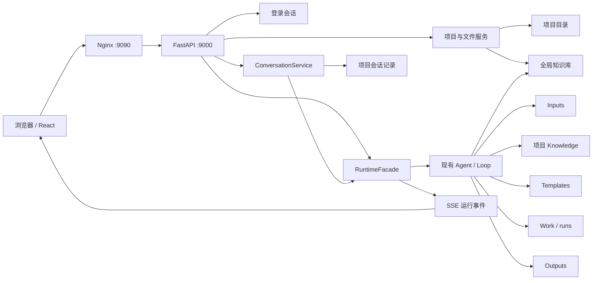

# Phase 1 Codex 风格浅色 Web 重构设计

**状态：** 待用户最终复核

**日期：** 2026-08-03

**分支：** `feature/react-fastapi-manyselves`

## 1. 背景

第一阶段已经具备 React、FastAPI、Nginx、Podman Compose、项目文件、会话、
Runtime、SSE、模型配置和报告输出能力，但当前界面仍保留工程控制台式三栏布局，
并把服务器文件、Access Token、Provider 管理和运行调试等低层概念直接暴露给普通
使用者。项目导航与文件操作也没有体现 Manyselves 已有的目录语义。

本设计在不替换 Agent 核心、Loop 编排、报告工作流、项目目录和单 Runtime 模型的
前提下，重构 Web 交互层并补齐简单登录、全局知识库和项目元数据能力。目标是形成
可部署、可测试、功能闭环的第一阶段产品，而不是提前引入第二阶段多租户基础设施。

## 2. 已确认目标

1. 采用 Codex 风格的浅色、安静、会话优先界面。
2. 访问服务器网址时，首页必须是登录页。
3. 默认账号为 `admin`，默认密码为 `yuanxi@2026`，由服务端校验。
4. 用户界面不再显示、存储或要求填写 Access Token。
5. 左侧顶层入口固定为“新对话、全局知识库、项目”。
6. 项目展开后完整显示“输入、知识库、输出模板、输出、运行态、日志”。
7. `输出模板`与`输出`严格分离；前者约束生成，后者保存最终结果。
8. 每个会话必须属于一个项目。
9. 所有“上传”都指从当前浏览器所在电脑选择或拖拽本地文件，再上传至服务器。
10. 模型配置同时支持简洁网页配置和服务器 YAML 配置，并共用现有配置服务。
11. 全局知识库必须真正进入 Agent 检索链路，不能只实现一个文件管理页面。
12. 保持服务器端口 `9000`、Nginx 对外端口 `9090`，支持无域名 IP 访问和
    Podman Compose 部署。

## 3. 非目标

本次不实现：

- 多租户、RBAC、个人账号体系或用户数据库；
- 多 Runtime、多 Worker 或不同项目并发执行；
- Redis、MySQL、Milvus、MinIO、LLM Wiki；
- 前端直接编辑任意 YAML 或任意服务器文件；
- 任意目录创建、重命名、删除或服务器文件选择器；
- Agent 身份、Loop、报告工作流或输出目录格式重写；
- 公网级 HTTPS 证书和域名接入。

第一阶段仍是同一企业内部共享一个管理员账号、一个 FastAPI 服务实例和一个活动
Runtime。多个浏览器可访问和浏览，但不同项目不能同时运行 Agent；已有 Runtime
忙碌和控制租约规则继续生效。

## 4. 方案选择

### 4.1 界面方案

放弃继续修补三栏工程控制台，也不为每项功能创建互不相干的页面。采用一个稳定的
浅色应用壳、项目树和主内容区：

- 左侧只承担全局导航、项目列表和当前项目的固定功能入口；
- 主内容区根据路由显示对话、项目主页、文件列表、运行态、日志或设置；
- 删除永久右侧 Agent 面板，运行详情归入项目“运行态”；
- 低频操作进入铅笔按钮、文件行省略号或折叠的高级设置。

### 4.2 模型配置方案

拒绝网页原始 YAML 编辑器，也不创建一套仅存在于浏览器的配置。React 继续调用
现有 Settings API，由 `SettingsService` 校验、保存和失败回滚，最终使用
`manyselves.config.yaml`。环境变量对密钥的覆盖保持最高优先级。

### 4.3 全局知识方案

拒绝把全局知识复制到每个项目或建立软链接。新增独立、只读可组合的知识源，并以
最小参数扩展现有 `ReferenceLibrary` 和 `KnowledgeContextBuilder`。项目知识优先，
全局知识作为所有项目可检索的补充来源。

## 5. 信息架构与视觉方向

### 5.1 应用壳

- 浅灰侧边栏、白色主内容区、中性色文字和边框；
- 取消深色标题栏、深色设置面板、仪表盘式卡片堆叠；
- 保持紧凑间距、清晰层级、标准图标和可见焦点状态；
- 主交互只有一个高强调动作，例如“发送”“上传文件”或“保存”；
- 兼容桌面浏览器和窄屏布局，不依赖固定三栏宽度。

### 5.2 左侧导航

```text
新对话
全局知识库

项目                              [+]
└── 能源管理                 [编辑] […]
    ├── 输入
    ├── 知识库
    ├── 输出模板
    ├── 输出
    ├── 运行态
    └── 日志
```

- 铅笔按钮只编辑项目显示名称和描述；
- 省略号只承载删除等低频项目操作；
- 不再在项目名称下堆放“导入文件、导入目录、新建文件、新建目录、重命名、删除、
  下载”；
- 固定功能入口不可创建、重命名、删除或下载；
- 既有子目录可以展开浏览，但 UI 不提供子目录的创建、重命名和删除。

### 5.3 项目主页

点击项目名称进入项目主页。主区域展示该项目的历史对话和“新对话”按钮。历史对话
支持打开、自动命名、重命名和删除，不堆入左侧项目目录树。

### 5.4 会话区

会话区由消息列表和底部输入框组成。删除以下入口：

- 引用服务器文件；
- 服务器文件列表；
- `.manyselves/artifact-gateway.key`；
- 添加服务器文件；
- 引用当前编辑文件；
- 引用当前选区。

输入框包含：

- 多行文本输入；
- `+` 按钮；
- 本次消息的附件标签；
- 发送按钮。

`+` 第一阶段只提供“上传本地文件”，支持多文件。移除附件标签只取消本次消息的重点
引用，不删除已经上传到项目 `Inputs/` 的服务器文件。

## 6. 路由与 React 组件边界

### 6.1 路由

| 路由 | 行为 |
|---|---|
| `/` | 未登录显示登录页；已登录恢复上次项目和对话 |
| `/knowledge` | 全局知识库 |
| `/projects/:projectId` | 项目主页和历史对话 |
| `/projects/:projectId/conversations/:conversationId` | Agent 对话 |
| `/projects/:projectId/inputs` | 输入 |
| `/projects/:projectId/knowledge` | 项目知识库 |
| `/projects/:projectId/templates` | 输出模板 |
| `/projects/:projectId/outputs` | 输出 |
| `/projects/:projectId/runtime` | 运行态 |
| `/projects/:projectId/logs` | 日志 |
| `/settings/models` | 简化模型设置 |

使用 `react-router-dom` 支持刷新、前进后退和直接定位。任何受保护路由在会话不存在或
失效时返回 `/` 登录首页。

### 6.2 组件

```text
App
├── AuthGate
│   ├── LoginPage
│   └── AuthenticatedApp
├── AppLayout
│   ├── Sidebar
│   └── MainOutlet
├── ProjectHomePage
├── ConversationPage
│   ├── MessageList
│   └── Composer
├── ProjectDirectoryPage
│   ├── FileList
│   ├── UploadDialog
│   ├── PreviewDialog
│   └── TextEditor
├── RuntimePage
├── LogsPage
├── GlobalKnowledgePage
└── ModelSettingsPage
```

`AppShell` 收敛为布局职责。项目目录页通过目录能力配置复用同一套文件组件，不复制
输入、知识库、模板和输出的 CRUD 逻辑。领域数据继续通过各自 API 模块和 Hook 获取。

## 7. 登录与会话认证

### 7.1 登录行为

1. 浏览器打开 `http://192.168.8.28:9090/`；
2. React 调用会话检查接口；
3. 未登录时只显示登录页；
4. 用户输入账号密码；
5. FastAPI 校验服务端配置；
6. 成功后写入 HttpOnly 会话 Cookie；
7. React 恢复上次项目和对话；
8. 会话失效或退出后返回登录首页。

默认配置：

- `MANYSELVES_ADMIN_USERNAME=admin`
- `MANYSELVES_ADMIN_PASSWORD=yuanxi@2026`

默认值存在于服务端配置默认项中，不写入 React bundle。第一阶段不要求首次登录修改
密码，也不新增用户表。

### 7.2 API 与 Cookie

新增：

- `POST /api/v1/auth/login`
- `GET /api/v1/auth/session`
- `POST /api/v1/auth/logout`

Cookie 使用 `HttpOnly`、`SameSite=Strict` 和限定路径。HTTP 内网部署不设置 `Secure`；
启用 HTTPS 后必须设置 `Secure`。所有非安全方法继续执行 Origin 校验。健康检查和登录
接口保持匿名可用，其他业务 API 和 SSE 要求有效会话。

会话签名密钥首次启动自动生成到数据根下的
`.manyselves/auth/session.key`，只允许服务端读取，永不出现在文件 API、React 或日志
响应中。登出清除 Cookie。部署验证脚本改为登录后执行检查，不再要求 Access Token。

现有 Bearer Access Token 表单、浏览器 sessionStorage token 和 Authorization 注入逻辑
删除；不能保留两个并行的用户认证入口。

## 8. 项目、目录与文件语义

### 8.1 现有物理结构

保持当前 `ProjectRegistry` 约定：项目目录直接位于数据根下，不新增 `projects/` 中间层，
因此旧项目无需迁移。

```text
/srv/manyselves/data/
├── default/
│   ├── Inputs/
│   ├── Knowledge/
│   ├── Templates/
│   ├── Work/
│   │   └── runs/
│   ├── Outputs/
│   │   ├── Modules/
│   │   ├── Reviews/
│   │   └── Reports/
│   └── .manyselves/
│       └── conversations/
├── <other-project-id>/
└── .manyselves/
    ├── auth/
    └── global-knowledge/
```

全局 `.manyselves/` 首字符不是项目 ID 允许字符，不会被 `ProjectRegistry` 误识别为
项目，同时仍处于统一数据卷和备份范围内。

### 8.2 UI 到物理结构映射

| UI 入口 | 数据来源 | 用途 |
|---|---|---|
| 输入 | `Inputs/` | 客户事实和本次任务原始资料 |
| 知识库 | `Knowledge/` | 当前项目参考资料 |
| 输出模板 | `Templates/` | 输出版式、字段和组织约束 |
| 输出 | `Outputs/` | 最终成果、模块和审核结果 |
| 运行态 | Runtime API 与 `Work/runs/` 的受控投影 | 当前任务、Agent、步骤和进度 |
| 日志 | 服务端日志与运行事件的受控投影 | 只读诊断和审计 |

UI 永远不显示绝对服务器路径、`.manyselves`、密钥、原始检查点或任意 `Work/` 文件树。

### 8.3 项目元数据

新增每项目隐藏元数据文件 `.manyselves/project.json`，存储稳定项目 ID 之外的显示名称和
描述。旧项目缺少该文件时使用目录名作为显示名称、空描述作为默认值。铅笔操作只修改
显示名称和描述，不重命名项目目录或项目 ID。

项目删除要求输入项目显示名称确认。运行中的项目不可删除；活动但空闲的项目应先切换
到另一个项目，再执行现有安全删除流程。

## 9. 浏览器本地文件上传

所有上传来源必须是当前浏览器所在电脑：

```text
用户电脑文件选择器或拖拽
        │ multipart/form-data
        ▼
Nginx :9090
        ▼
FastAPI 上传接口
        ▼
服务器临时文件、校验、原子替换
        ▼
目标知识库或项目目录
```

规则：

- 使用浏览器原生文件选择器和拖拽，支持多文件；
- 浏览器只提交文件内容、文件名、大小和 MIME 信息，不依赖或上传本地绝对路径；
- 不提供服务器路径输入、服务器文件选择或服务器目录导入；
- 对话 `+` 上传固定写入当前项目 `Inputs/`；
- 输入、项目知识库、输出模板和全局知识库页面分别写入其授权根目录；
- 输出、运行态和日志不提供上传；
- FastAPI 执行路径规范化、文件名清理、大小限制、类型检查、流式暂存和原子落盘；
- 中途断开时清理临时文件；
- 同名文件禁止静默覆盖，返回稳定冲突错误后由 UI 提供“替换、保留两份、取消”；
- “保留两份”在服务端生成无冲突名称；“替换”仍执行修订检查和原子替换；
- Electron 客户端以后继续调用同一 multipart API，不直接操作服务器磁盘。

## 10. 文件操作矩阵

| 区域 | 上传 | 在线编辑 | 预览 | 替换 | 删除 | 下载 |
|---|---:|---:|---:|---:|---:|---:|
| 全局知识库 | 是 | 文本类 | 是 | 是 | 是 | 是 |
| 输入 | 是 | 文本类 | 是 | 是 | 是 | 是 |
| 项目知识库 | 是 | 文本类 | 是 | 是 | 是 | 是 |
| 输出模板 | 是 | 文本类 | 是 | 是 | 是 | 是 |
| 输出 | 否 | 否 | 是 | 否 | 是，二次确认 | 是 |
| 运行态 | 否 | 否 | 只读 | 否 | 否 | 否 |
| 日志 | 否 | 否 | 只读 | 否 | 否 | 可下载 |

Markdown、TXT、JSON、YAML、Python 和其他允许的文本/代码文件可以在线编辑。PDF、
DOCX、Excel 和图片只允许预览、替换、删除或下载。输出删除只删除交付文件，不删除或
伪造相应运行记录，并在确认框中明确提示。

## 11. 全局知识库

### 11.1 存储与 API

全局知识文件存储于：

```text
/srv/manyselves/data/.manyselves/global-knowledge/
```

新增 `GlobalKnowledgeService`，内部复用 `WorkspaceFiles` 的路径、防穿越、修订、上传和
下载能力，但根目录固定为全局知识目录。对应 API 只暴露相对文件信息，不返回物理路径。

### 11.2 Agent 集成

对 `ReferenceLibrary` 和 `KnowledgeContextBuilder` 增加可选的附加只读知识根参数：

- 默认根仍为当前项目 `Knowledge/`；
- 附加根为全局知识目录；
- 同名或同标识冲突时项目知识优先；
- 检索结果和来源清单包含 `project` 或 `global` 来源命名空间；
- 不把全局知识全部注入提示词，只通过现有检索和有界上下文构建按需使用；
- 每个 run 在 `Work/runs/<run-id>/` 保存实际使用的知识清单、修订摘要和来源；
- 运行开始后使用固定清单，后续上传或删除不会偷偷改变正在执行的 run。

这是本设计唯一直接触及报告知识读取核心的扩展。它不改变 Agent 数量、身份、消息协议、
Loop、工作流状态机或输出合同。

## 12. 模型配置

简化页面只保留：

- 模型提供商；
- API 地址（可选）；
- API Key（遮罩且不回显）；
- 默认模型；
- 测试连接；
- 保存。

数据优先级：

```text
环境变量密钥覆盖（最高优先级，只读）
              ↓
manyselves.config.yaml
              ↑
React → Settings API → SettingsService → ConfigManager
```

环境变量覆盖的字段由 API 返回 `credentialSource=environment`，React 显示“由服务器
环境管理”并禁止覆盖。YAML 管理的密钥只返回 `configured=true`，永不回显。Provider
增删、预设同步、超时、并发和重试等低频项目放入默认折叠的高级设置。删除服务器连接
和 Access Token 设置卡片。

管理员可以手动修改服务器上的 `manyselves.config.yaml`，重启服务后加载；网页保存和
手动编辑共用同一模型，不引入第二份配置数据库。

## 13. 端到端功能流



发送消息时，前端必须携带项目和会话上下文。服务端确认会话属于该项目、必要时通过
现有事务切换活动项目，然后由 `ConversationService` 和 `RuntimeFacade` 进入现有运行
链路。Agent 读取输入、项目知识、全局知识和模板，中间态写入 `Work/runs/`，最终成果
写入 `Outputs/`。React 通过 SSE 更新对话、运行态和输出状态，不轮询服务器目录。

顶层“新对话”在没有当前项目时先要求选择或新建项目；从项目主页创建时直接绑定当前
项目。登录成功后优先恢复上次项目和对话；不存在时进入项目选择/新建流程。

## 14. 错误处理

- 登录失败停留在登录页，并显示通用凭据错误；
- 会话过期统一回到登录页，不在各页面分别处理；
- Runtime 忙、项目切换冲突和控制租约错误使用现有稳定错误码；
- 上传冲突、超限、类型不支持、修订冲突和路径不安全映射为明确用户提示；
- 文件 CRUD 成功后以服务端响应刷新，不假定本地操作已经落盘；
- SSE 中断后按现有序列恢复规则重连，并在无法连续恢复时重新获取快照；
- 全局知识索引/解析失败保留原文件并显示失败状态，不把失败文件伪装成可检索；
- 设置变更失败使用现有持久化回滚，不显示部分成功；
- 删除项目、输出和知识文件均使用服务端最终确认结果更新界面。

## 15. 安全与隐私

- 所有业务 API、SSE、预览和下载均要求会话；
- 服务端继续执行路径穿越、符号链接、大小、修订和内容类型防护；
- 文件响应只暴露相对逻辑路径；
- 密钥、Cookie、密码、API Key 和内部路径不写日志、不进入 SSE、不返回 React；
- Cookie 模式配合 SameSite 和 Origin 校验，避免把 Access Token 暴露给 JavaScript；
- `192.168.8.28:9090` 的 HTTP 形式只适用于可信内网；公网部署前必须添加 TLS；
- 固定默认密码是用户确认的第一阶段简化选择，不宣称具备多用户安全隔离。

## 16. 兼容与部署

- 旧项目仍直接位于 `MANYSELVES_DATA_DIR`，不进行目录迁移；
- 缺少新元数据时使用兼容默认值；
- 旧会话、检查点、报告和 Outputs 继续读取；
- Nginx 继续提供 React 静态资源、SPA fallback、API/SSE 反向代理；
- API 继续单副本、单 Gunicorn Uvicorn worker，避免创建多个进程内 Runtime；
- Compose 服务和端口保持 API `9000`、Web/Nginx `9090`；
- Podman Compose 启动方式保持不变，但环境样例移除访问令牌并增加管理员账号配置；
- 部署检查、备份和恢复将全局 `.manyselves/global-knowledge` 与认证密钥纳入数据卷；
- 第一阶段不增加外部基础设施容器。

## 17. 测试与验收

### 17.1 前端

- 登录、退出、会话失效和受保护路由；
- 左侧导航、完整六入口、项目元数据编辑和省略号菜单；
- 项目主页、历史对话和项目绑定新对话；
- 浏览器多文件上传、附件标签和同名冲突选择；
- 文件能力矩阵、文本编辑、非文本预览、输出只读；
- 简化模型设置和环境管理字段；
- 浅色布局的窄屏响应、键盘焦点和可访问名称。

### 17.2 后端

- 登录 Cookie、签名、过期、退出、Origin 和 API/SSE 保护；
- 项目元数据兼容、修订和删除保护；
- 全局知识文件 CRUD、安全路径和上传中断清理；
- 项目知识优先、全局知识来源标记、run 知识快照和运行中稳定性；
- 上传冲突三种处理、文件限制和原子写入；
- 设置来源标识、密钥遮罩、保存回滚和环境覆盖；
- 现有 Runtime、Conversation、Reporting 和失败恢复回归测试。

### 17.3 端到端与部署

必须覆盖：

1. 打开 `192.168.8.28:9090` 显示登录页；
2. 使用默认账号登录；
3. 创建项目并显示六个完整入口；
4. 从测试浏览器电脑上传多个文件；
5. 创建绑定项目的对话并启动 Agent；
6. SSE 显示运行状态；
7. 最终成果出现在 Outputs 并可预览、下载；
8. 全局知识和项目知识来源均可审计；
9. 旧项目无需迁移即可使用；
10. React 单元测试、API 合约测试、Python 回归、E2E、镜像构建和 Podman 冒烟全部通过。

## 18. 实施边界

实施只允许落在以下范围：

- React 路由、布局、页面、共享文件组件和样式；
- FastAPI 登录会话、项目元数据和全局知识 API；
- 应用层的全局知识服务与已有服务组合；
- `ReferenceLibrary` / `KnowledgeContextBuilder` 的附加只读根最小扩展；
- 配置 DTO 的凭据来源标识；
- 测试、OpenAPI 合约、部署配置和文档。

任何需要新增数据库、任务队列、多 Runtime、RBAC、任意服务器文件浏览器或重新设计
Agent 协议的需求都必须停止并重新设计，不能在实施中顺手扩散。
